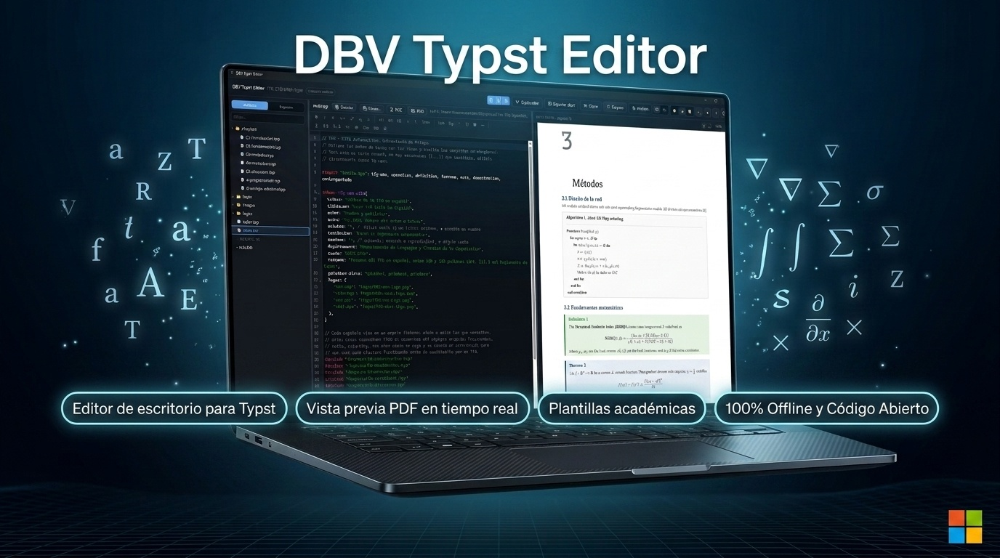

# DBV Typst Editor

**[🇪🇸 Español](./README.md) · 🇬🇧 English**

[](https://davidbuenov.github.io/dbv-typst-editor/en/)
[](https://github.com/davidbuenov/dbv-typst-editor/releases)
[](https://apps.microsoft.com/store/detail/9PCPSVTNJMP0?cid=DevShareMCLPCB)


-0078D6?logo=windows&logoColor=white)
-000000?logo=apple&logoColor=white)


[](https://github.com/davidbuenov/dbv-specs-ops)

> A lightweight, offline-first, cross-platform desktop editor for [Typst](https://typst.app) documents, with real-time PDF preview. *"Academic and technical writing made simple. Powered by Typst."*
>
> 🌐 **Official Website:** [https://davidbuenov.github.io/dbv-typst-editor/en/](https://davidbuenov.github.io/dbv-typst-editor/en/)

<p align="center">
  <a href="https://davidbuenov.github.io/dbv-typst-editor/en/">
    
  </a>
</p>

---

## 📑 Table of Contents

- [About](#-about)
- [Current status](#-current-status)
- [Download and install](#-download-and-install)
- [Target audience](#-target-audience)
- [What it can do](#-what-it-can-do)
- [Requirements](#-requirements)
- [Using an AI (guide)](./docs/IA.en.md)
- [Installation (development)](#-installation-development)
- [How to run](#-how-to-run)
- [How to stop](#-how-to-stop)
- [Project structure](#-project-structure)
- [Changelog](#-changelog)
- [References](#-references)
- [License](#-license)
- [Acknowledgments](#-acknowledgments)
- [Author & Credits](#-author--credits)

---

## 📌 About

**DBV Typst Editor** is a native desktop editor for [Typst](https://typst.app) documents, built for teachers, researchers, PhD candidates, university students, and technical writers who need to produce professional-quality academic and technical PDFs without relying on LaTeX or online-only tools.

It follows the same philosophy as its sibling project [DBV Markdown Reader](https://github.com/davidbuenov/dbv-md-reader): lightweight, fast, cross-platform, offline-first, with a clean interface and a pleasant writing experience. It reuses, wherever possible, the architecture, components, and design decisions already validated in that project.

**Built with:** Rust, Tauri v2, Typst CLI/crate, HTML5, Tailwind CSS, JavaScript.

---

## 🚦 Current status

**Current version:** `v0.13.1` · **Status:** 🟢 Stable and production ready

- 🌐 **Official Website:** [https://davidbuenov.github.io/dbv-typst-editor/en/](https://davidbuenov.github.io/dbv-typst-editor/en/) (featuring full-resolution interactive screenshot gallery and bilingual ES/EN switch).
- 📦 **Installers available on Releases:** [GitHub Releases](https://github.com/davidbuenov/dbv-typst-editor/releases):
  - 🪟 **Windows**: only through the [Microsoft Store](https://apps.microsoft.com/store/detail/9PCPSVTNJMP0?cid=DevShareMCLPCB) (there is no `.exe` installer on Releases since `v0.8.0`).
  - 🍎 **macOS**: Universal `.dmg` (compatible with Apple Silicon & Intel).
  - 🐧 **Linux**: `.AppImage` (portable) and `.deb` (Debian/Ubuntu/Mint) packages.
- 🏬 **Microsoft Store:** published on the official store. [🛒 Get it from Microsoft Store (ID 9PCPSVTNJMP0)](https://apps.microsoft.com/store/detail/9PCPSVTNJMP0?cid=DevShareMCLPCB). If you installed an earlier Store package, make sure you get `v0.3.1` or later (see [`CHANGELOG.en.md`](./dbv-specs-ops/CHANGELOG.en.md)).
- 🧪 **Quality & Stability:** 1,843 automated tests passing at 100% (1,339 frontend tests + 504 Rust backend tests), AI evaluation with real local models and layout verification in real rendering engines.
- 🚀 **Key Highlights:**
  - **The AI with local models and with Gemini, more honest (v0.13.1):** the assistant no longer announces proposals that do not exist, shows **what the model is thinking** (collapsible block), **what it is doing and how fast**, and warns about a **model that is too small or a context that is too short**; reasoning ships **off** and is turned on per connection; when it writes it **separates presentation from content** (the look goes in style files); **Gemini 3 can use tools again**. New **"New empty .typ…"** to create a loose document without creating a project (the AI only sees its own file). The guide finally includes **measured numbers** for local models (`qwen3:8b` solves a little over 1 in 3 tasks: always review what it proposes) and a cloud reference, and `eval:ai` also measures cloud AIs.
  - **Built-in, optional AI assistant (v0.13.0):** connect a local AI (Ollama, LM Studio), a cloud one with your API key (Anthropic, OpenAI, Gemini, OpenRouter) or your installed agent with your subscription (Claude Code, Gemini CLI, Codex, Copilot). Chat with the project as context; it proposes multi-file changes that DBV **compiles in memory** before showing them and that you review hunk by hunk before applying (with Undo); inline AI on the selection (Ctrl+Shift+I) and "Explain and fix" on errors. With nothing configured, the editor works exactly as before; with a local AI nothing leaves your computer; keys go to the system credential store. **[📖 Guide: what you need to install to use each AI](./docs/IA.en.md).** Plus: **offline official Typst documentation** (for the exact compiler version, searchable), a **Problems panel** with the full error list and a **CSV/TSV data viewer** with "Insert as table".
  - **Outline from the preview, plus fixes (v0.12.1):** the Outline panel comes from the same compilation as the preview, instantly and without compiling twice; it lists the headings that would go in the table of contents and, when it cannot show them, says why (document with errors or tool failure) instead of "no headings". Fixes the Linux AppImage (Tinymist, export and the classic engine did not start), the preview spilling out of the window with a narrow panel, and word-level sync after falling back to the classic engine; if the preview is on the fallback engine, a notice lets you switch back to the fast one.
  - **Tabs, navigation and refactoring, project-wide search and snippets (v0.12.0):** every open file gets its own tab (Ctrl+W, Ctrl+Tab, drag to reorder) and keeps its unsaved changes, cursor and undo history; tabs are restored when the project is reopened. With Tinymist: go to definition (F12 or Ctrl+click), find references (Shift+F12), rename a symbol across all files (F2) and code actions (Ctrl+.). Find and replace across the whole project (Ctrl+Shift+F) with regular expressions and file filters, undoable in one step. User snippets in VS Code format, global or per project. Find (Ctrl+F) and copy text straight from the preview. Every shortcut is documented in Help. The main document is saved in `settings/dbv-project.toml` and travels with the project (git, `.dbvt`). Fixes Tinymist autocompletion inside function calls (now with signature help), errors underlined in the wrong file and the page jump when changing the zoom; the AppImage supports incremental updates (`.zsync`).
  - **File explorer, self-updating references, preview links and local history (v0.11.0):** the Files panel can create, rename (F2), duplicate, delete to the trash and drag files and folders; when moving or renaming, the `#include`, `image()`, `bibliography()`… of the whole project are rewritten with Typst's own parser, with "View changes" and "Undo". "New chapter…" creates the file and links it from the main document. Preview links work (web to the browser; outline, references, citations and footnotes to their target), and every save keeps a local copy you can compare and restore. It also fixes the external-change warning that kept popping up with auto-save on.
  - **Optional auto-save, a modified dot, and closing the window always protected (v0.10.0):** saves only after a typing pause or when focus is lost, never overwriting an external change; the "unsaved" text becomes a discreet dot next to the document name. Also: BibTeX syntax highlighting, hidden files out of the tree by default, optional line numbers, an always-visible refresh button, and a short, disambiguated path in the document bar — seven improvements born from a friend of the user's trying v0.9.0 and sending a list of "things to fix".
  - **Fast preview engine (v0.9.0):** Typst as a library inside the app — each edit of a 224-page book takes ≈0.5 s instead of ≈4.6 s — with exact word-by-word sync in both directions (double-click or right-click on the render; Ctrl+Alt+P from the editor), diagnostics underlined in the editor, context menus and code-file editing (`.cpp`, `.java`, `.py` and ~40 more types). The classic engine is the automatic fallback.
  - Performance with large documents: the preview releases pages that scroll far away (a 220-page book no longer grows to several GB), the typing pause adapts to how long compiling takes, and a loose `.typ` in a huge folder (Downloads, Desktop) opens in seconds instead of almost a minute.
  - Selectable main document: a **main** badge in the file tree and a context menu (right-click) or the File menu to mark which file the preview compiles — essential in projects without a `main.typ`. It is remembered per project and writes nothing into your folder.
  - Tinymist on demand and switchable off from its badge: it starts by itself for small documents and waits for you to enable it on large ones.
  - Homebrew install on macOS and Linux (`brew tap davidbuenov/dbv-typst-editor && brew install --cask dbv-typst-editor`), with a `typs` command-line command to open a document or a folder.
  - Visual, interactive equation editor with a REAL preview compiled by Typst on every pause, plus "Paste LaTeX" via the MiTeX package.
  - Five more diagramming assistants: flowcharts with decisions, sequence diagrams (Chronos), Gantt charts with real dates (Gantty), Kanban boards (Kantan) and DOT/Graphviz graph rendering (Diagraph) — each reachable from the Tools menu, with a contextual help button and a link to the package's original documentation.
  - WYSIWYG diagram editor: nodes, arrows with direction/stroke/label, colors, zoom and drag-and-drop — translates to readable `cetz.canvas` code and can be reopened for further editing.
  - Contextual zoom with keyboard and mouse wheel: adjusts the editor's font size or the preview's zoom depending on where the focus is.
  - Git integration: status, commit, push, pull and clone by URL from the header, with a diff viewer and visual merge-conflict resolution.
  - Full Universe Browser: search across the real Typst Universe catalog (~4,700 packages and templates), not just a curated list, with automatic package/template detection.
  - Bidirectional editor ↔ preview synchronization (double-click on preview jumps to source code and pin button takes preview to cursor).
  - Whole-document compilation (`main.typ`) preserving cross-references and chapters, with automatic/manual refresh control.
  - Visual bibliography with `hayagriva`: citation autocomplete with title/author/year and a warning for duplicate or incomplete entries.
  - Official Typst Language Server (tinymist) built in: semantic autocomplete, live diagnostics, and one-click formatting.
  - Built-in Python runner (Matplotlib, NumPy, pandas) and a JavaScript runner with `jogs` for dynamic figures and data.
  - Paste an image straight from the clipboard, in addition to universal drag-and-drop.
  - 8 pre-configured academic templates with self-contained embedded fonts.
  - Self-contained project archives in `.dbvt` format.
  - 3 visual themes (Light, Dark, and warm Sepia) plus an integrated advanced Typst terminal.

---

## 🚀 Download and install

**No need to install Rust, Node.js, or any programming tool.** The installer bundles everything required — including the Typst compiler — and associates `.typ` files for you.

### 🪟 Windows

**[🛒 Get it from Microsoft Store](https://apps.microsoft.com/store/detail/9PCPSVTNJMP0?cid=DevShareMCLPCB)**

Since `v0.8.0`, Microsoft Store is the **only** install channel for Windows: the package is signed by the Store itself (no SmartScreen warnings), installs with one click and updates itself in the background. It was chosen because the Store publishes updates very quickly and is the safest way to receive them: it does not depend on every user downloading and running an installer by hand.

The `.exe` installer on GitHub Releases is **discontinued**. If you already installed it that way, install from the Store to keep receiving updates: they are two different application identities, so they will coexist as two separate entries in "Installed apps" until you uninstall the old one. The `.exe` install will not receive `v0.8.0` or later through "Check for updates".

*(Store ID `9PCPSVTNJMP0`. The version the Store offers is always the latest one Microsoft has certified; it can lag a few days behind GitHub. See [`CHANGELOG.en.md`](./dbv-specs-ops/CHANGELOG.en.md).)*

### 🍺 Homebrew (macOS & Linux)

```bash
brew tap davidbuenov/dbv-typst-editor
brew install --cask dbv-typst-editor
```

Works on **macOS** (Intel and Apple Silicon) and **Linux x86_64**. On Linux it needs Homebrew 6.0.0 or later (the release that added AppImage casks) and FUSE 2 to run AppImages (`libfuse2` on Debian/Ubuntu). The tap ([davidbuenov/homebrew-dbv-typst-editor](https://github.com/davidbuenov/homebrew-dbv-typst-editor)) updates itself on every new Release; update with `brew upgrade --cask dbv-typst-editor`. On macOS it does not replace the Gatekeeper prompt described below: the `.dmg` is still not signed or notarised by Apple.

**From the terminal:** the Cask also installs a `typs` command, to open the app without leaving the keyboard:

```bash
typs                 # open the app
typs report.typ      # open a document
typs thesis/         # open a folder as a project
typs .               # open the current folder
```

If the app is already running, `typs` reuses the same window. `brew uninstall --cask dbv-typst-editor` removes it.

### 🐧 Linux

**[⬇️ Download the `.deb` or `.AppImage` from Releases](https://github.com/davidbuenov/dbv-typst-editor/releases)** — built automatically on every version via CI.

> Since `v0.12.0`, the `.AppImage` carries update information: [AppImageUpdate](https://github.com/AppImageCommunity/AppImageUpdate) and compatible tools download only what changed between versions (`.zsync`).

### 🍎 macOS

**[⬇️ Download the `.dmg` from Releases](https://github.com/davidbuenov/dbv-typst-editor/releases)** — universal build (Apple Silicon + Intel), built automatically via CI. Unsigned and unnotarized: right-click the app → **Open** to bypass Gatekeeper the first time, or run `xattr -cr "DBV Typst Editor.app"` from Terminal.

---

## 🎯 Target audience

- University professors and teachers
- Researchers and PhD candidates
- University students (undergraduate/master's theses)
- Technical writers
- Anyone who wants to produce professional PDFs with Typst without friction

---

## ✅ What it can do

Grouped by what you want to do. Each version’s detail is in the [`CHANGELOG`](./dbv-specs-ops/CHANGELOG.en.md); the in-app help (the **?** button) walks through each topic step by step.

> ℹ️ The following describes the development branch: **Apply template…**, the Typst Universe tools, the rendered pages and the fonts for the AI, and the **MCP server** arrive with **v0.14.0** (the latest published is v0.13.1).

### ✍️ Writing
- **A real Typst editor** (CodeMirror 6): Typst 0.15 syntax highlighting, autocompletion of functions and symbols, folding, multiple cursors, find and replace, and **one tab per file** that keeps changes, cursor and undo history.
- **Insertion toolbar and assistants**: formatting, headings, lists, tables, figures (also by pasting an image from the clipboard), citations from the project’s real bibliography and a gallery of maths symbols.
- Your own and per-project **snippets**, with import from VS Code and from Sublime Text.
- With **Tinymist** (on demand): semantic completion, go to definition, find references, rename symbols and format.
- **Find and replace across the whole project**, with regular expressions, and a **file explorer** that rewrites `#include`, `image()`… when you move or rename, with local version history.

### 👀 Seeing the result
- **In-process preview**: Typst as a library, ≈0.5 s per edit in a 224-page book, with exact word-by-word synchronization between editor and preview in both directions.
- A syntax error mid-typing **does not clear** the view: the last good one stays and the problem shows in a band. **Problems** panel, outline, find and copy text in the preview, and internal links.
- **Everything offline**: the compiler and the Typst documentation ship with the app.

### 🧩 Templates, packages and fonts
- **8 own templates** (blank, bachelor’s thesis, master’s thesis, doctoral thesis, paper, report, presentation and CV), with a form that writes your data into the document.
- **Typst Universe** (~4,700 packages and templates): a gallery with preview, a search over the whole catalog and a free identifier.
- **Apply template…** to a document you already have (for example, turn it into IEEE): DBV adds the `#import` and the `#show`, moves the title, authors and abstract into its parameters and leaves the rest untouched, as a proposal you review.
- **Your own fonts** in `fonts/`: picked up instantly, they travel with the project and you can drag a missing one onto the editor.

### 📊 Figures and data
- Visual editors for **equations** (with "Paste LaTeX"), node-and-arrow **flowcharts** (CeTZ), **sequence** diagrams, **Gantt**, **Kanban** and **DOT/Graphviz**, each with its preview and help.
- **Data viewer** for CSV/TSV, and running **Python** and **JavaScript** (jogs) for figures and dynamic data.

### 🤖 Optional AI: local, cloud or your subscription
- **You choose where it lives**: a local model (Ollama, LM Studio, llama.cpp…) with nothing leaving your computer, a provider with your API key (Anthropic, OpenAI, Gemini, OpenRouter) or your installed agent with your subscription (Claude Code, Gemini CLI, Codex, Copilot). With no AI connected, the editor works the same.
- **It never writes without you seeing it**: it proposes changes in one or several files, DBV **compiles them in memory**, and you accept or reject each hunk, with Undo.
- **It works on your project**: it reads the files, looks up the Typst documentation, searches **real** Universe templates and packages (it never invents a name or version), cites only references that exist in your `.bib`, **sees the rendered pages** to judge the layout and, with the cloud, offers a missing typeface (you confirm).
- Inline actions on the selection (Ctrl+Shift+I), "Explain and fix" for an error, and an evaluation with real local models published with its numbers: see the [AI guide](./docs/IA.en.md).

### 🔌 MCP server for other agents (v0.14.0)
- Tools › **MCP server…** gives, ready to copy, the configuration for **Claude Code, Claude Desktop, Cursor, Codex…** to use DBV’s exact compiler, see the rendered pages and query the documentation and Universe. The agent in DBV’s panel receives it by itself.
- **Read-only, no network and confined to the project**; installing a package requires your confirmation in a dialog, and sharing the editor state (tabs with unsaved text) is a separate setting, off by default. Details in the [AI guide](./docs/IA.en.md#6-dbvs-mcp-server-dbvs-tools-for-other-agents).

### 📦 Project and distribution
- A DBV project is a **standard Typst project**: it compiles with plain `typst`, with no lock-in and nothing odd written in your folder. Built-in **Git** (commit, push, pull, clone and conflict resolution).
- Export **PDF** and **PNG**, and pack everything into a `.dbvt`.
- **No telemetry, no accounts**; light, dark and sepia themes; Spanish and English interface.
- **Windows** (Microsoft Store), **macOS** (`.dmg` and Homebrew) and **Linux** (AppImage, `.deb` and Homebrew).

Full requirements and acceptance criteria live in [`dbv-specs-ops/docs/SPECIFICATIONS.md`](./dbv-specs-ops/docs/SPECIFICATIONS.md).

---

## 🧰 Requirements

- [Rust](https://www.rust-lang.org/) 1.76+ and the [Tauri v2](https://v2.tauri.app/start/prerequisites/) toolchain
- Node.js 20+ (if the frontend uses a bundler)
- [Typst](https://github.com/typst/typst) (CLI or embedded crate — decision pending in `ARCHITECTURE.md`)

---

## ⚙️ Installation (development)

```bash
# Clone the repository
git clone https://github.com/davidbuenov/dbv-typst-editor.git
cd dbv-typst-editor

# Install frontend dependencies
npm install

# Download the official Typst compiler that ships inside the app (sidecar).
# REQUIRED step: without it the application cannot compile documents.
npm run vendor:typst

# (optional) Verify the sidecar against the real binary: 8 checks
npm run verify:typst
```

The Typst binary is **not committed to the repository**: it is downloaded from the official release pinned in `scripts/vendor-typst.mjs`. The same step runs in CI before packaging.

Additional requirements: the [Tauri v2 prerequisites](https://v2.tauri.app/start/prerequisites/) for your operating system.

---

## ▶️ How to run

**Windows:**
```cmd
start.cmd
```

**macOS / Linux:**
```bash
./start.sh
```

---

## ⏹ How to stop

**Windows:**
```cmd
stop.cmd
```

**macOS / Linux:**
```bash
./stop.sh
```

---

## 📂 Project structure

```
/
├── src/                          # Frontend (ESM, no monolith)
│   ├── app/                       # Workspace state, tabs, preferences
│   ├── editor/                     # CodeMirror 6 editor, Typst language and assistants
│   ├── preview/                     # Real-time preview
│   ├── ai/                           # AI assistant (connections, panel, tools, proposals)
│   ├── mcp/                           # MCP server: editor state and configuration dialog
│   ├── launcher/ · project-wizard/     # Launcher, template gallery and project wizard
│   ├── project-explorer/ · search/      # File tree and project search
│   ├── outline/ · problems/ · history/   # Outline, Problems panel and local history
│   ├── universe/ · snippets/ · docs/      # Typst Universe, snippets and Typst documentation
│   ├── help/ · terminal/ · data/           # In-app help, terminal and data viewer
│   ├── services/                            # The only boundary with the backend
│   └── panels/ · ui/ · themes/ · i18n/       # Panels, controls, themes and translations
├── src-tauri/                    # Rust backend
│   └── src/                       # engine/ (in-process compiler), typst_engine/ (sidecar),
│                                   # ai/ (AI, Universe, rendering, fonts), mcp.rs and mcp_bridge.rs
│                                   # (MCP server), commands/, project.rs, templates.rs, watcher.rs…
├── templates/local/              # Own templates, as `@local` packages
├── docs/                         # Project website (GitHub Pages) and AI guide
├── testfiles/                    # Test document and project, and the AI evaluation
├── scripts/                      # Vendoring and dependency-free checks
├── dbv-specs-ops/                # SDD documentation (specs, architecture, memory, changelog)
├── start.cmd / start.sh          # Startup scripts
├── stop.cmd / stop.sh            # Stop scripts
└── README.md                     # This file
```

---

## 📋 Changelog

`v0.8.0` documented in [`dbv-specs-ops/CHANGELOG.en.md`](./dbv-specs-ops/CHANGELOG.en.md) — performance with large documents (preview page release, bounded temporary replica, adaptive typing pause), a main document selectable from the tree, Tinymist on demand, and a Homebrew channel for macOS and Linux with the `typs` command. `v0.7.0` added: a visual, interactive equation editor, five new diagramming assistants (sequence, Gantt, Kanban, DOT/Graphviz and flowcharts with decisions), a contextual help button linking to each assistant's original documentation, contextual zoom with keyboard/wheel, and a batch of UX fixes (stuck splitter, `ResizeObserver` warning, home screen redesign) found using the app on a real project.

The changelog is maintained in both languages: [English](./dbv-specs-ops/CHANGELOG.en.md) · [Español](./dbv-specs-ops/CHANGELOG.md).

---

## 📚 References

- **Voynov, A., Corbi, A., López-Oliver, P., & Gil, D. (2026).** [*Typst: A Modern Typesetting Engine for Science*](https://doi.org/10.9781/ijimai.2026.2269). *International Journal of Interactive Multimedia and Artificial Intelligence, 9*(7), 107–120. A systematic review of the Typst ecosystem (engine, language, Typst Universe packages, adoption) with case studies in Physics, Math and Computer Science. Section XI ("Application of Typst for Computer Science") catalogs diagramming packages — Fletcher/Matofletcher (flowcharts), CeTZ (trees, charts), Diagraph (DOT/Graphviz via Wasm), Pintora/Pintorita (activity, class, ER diagrams), Chronos (sequence diagrams), Gantty/Timeliney (Gantt charts) and Kantan (Kanban boards) — that serve as a reference map for evaluating future integrations in the editor. One of its authors, **Alberto Corbi**, is a collaborator on this project (see the Author & Credits section below).

---

## 📄 License

MIT — see [LICENSE](./LICENSE) for details.

Copyright (c) 2026 David Bueno Vallejo

---

## 🙏 Acknowledgments

This app wouldn't exist without a good number of open-source projects. Thanks to their authors and maintainers:

### Engine and language

- [Typst](https://typst.app) — the typesetting engine the whole app is built around (vendored as a compilation sidecar binary and, since v0.9.0, its `typst`, `typst-ide`, `typst-layout`, `typst-svg` and `typst-kit` crates linked into the app for the in-process preview engine; Apache-2.0 licensed).
- [Hilbert Editor](https://github.com/aburousan/hilbert-editor) (MIT) — studying its click→source sync through each glyph's `Span` inspired v0.9.0's render↔source map; the implementation is our own.
- [Tinymist](https://github.com/Myriad-Dreamin/tinymist) — Typst's official Language Server, vendored for semantic autocompletion, live diagnostics and formatting.

### Typst Universe packages powering the app's own visual assistants

- [cetz](https://typst.app/universe/package/cetz) — the drawing engine behind the WYSIWYG diagram editor.
- [MiTeX](https://typst.app/universe/package/mitex) — converts LaTeX pasted into the visual equation editor.
- [Chronos](https://typst.app/universe/package/chronos) — sequence diagrams.
- [Gantty](https://typst.app/universe/package/gantty) — Gantt charts with real dates.
- [Kantan](https://typst.app/universe/package/kantan) — Kanban boards.
- [Diagraph](https://typst.app/universe/package/diagraph) — DOT/Graphviz graph rendering via a Wasm plugin.
- [jogs](https://typst.app/universe/package/jogs) — embedded JavaScript runtime (QuickJS) for figures and dynamic data.

### Core pieces of the application

- [Tauri](https://tauri.app) — the desktop framework (Rust + native WebView) the whole app runs on, along with its `shell`, `dialog`, `updater`, `process` and `single-instance` plugins.
- [CodeMirror 6](https://codemirror.net) and [codemirror-lang-typst](https://github.com/kxxt/codemirror-lang-typst) — the code editor and its Typst syntax highlighting.
- [Hayagriva](https://github.com/typst/hayagriva) — the very same BibTeX/Hayagriva bibliography engine the Typst compiler itself uses for `#bibliography()`.
- [Vite](https://vite.dev) — frontend bundling and dev server.
- [jsonc-parser](https://github.com/microsoft/node-jsonc-parser) — reading and editing snippet files in VS Code format while keeping their comments.
- Rust crates: [serde](https://serde.rs)/serde_json, [tokio](https://tokio.rs), [notify](https://github.com/notify-rs/notify), [toml](https://github.com/toml-rs/toml), [tempfile](https://github.com/Stebalien/tempfile), [zip](https://github.com/zip-rs/zip2), [dunce](https://gitlab.com/kornelski/dunce), [base64](https://github.com/marshallpierce/rust-base64), [toml_edit](https://github.com/toml-rs/toml), [regex](https://github.com/rust-lang/regex), [walkdir](https://github.com/BurntSushi/walkdir), [ureq](https://github.com/algesten/ureq) and [sys-locale](https://github.com/1Password/sys-locale) (macOS).

Thanks also to the maintainers of every package curated in the app's Universe Browser (see [`src/universe/curatedCatalog.js`](./src/universe/curatedCatalog.js)) — IEEE/ACM/Springer templates, `fletcher`, `touying`, `quick-maths`, `physica`, `codly`, `zebraw`, `showybox`, `tablem`, `subpar`, `lovelace`, `glossarium`, `unify`, `wordometer` and the rest — for their work, even where this list doesn't name every one individually.

### Microsoft Store publishing

- [tauri-windows-bundle](https://github.com/Choochmeque/tauri-windows-bundle), by **Vladimir Pankratov** — the tool that builds the `.msix` package this app ships to the Microsoft Store; without it, Tauri's official path to the Store would require a paid Authenticode certificate.

---

## ✍️ Author & Credits

### 👤 David Bueno Vallejo

> Original idea, architecture, project direction and development.

[](https://www.linkedin.com/in/davidbueno/)
[](https://davidbuenov.com)
[](https://github.com/davidbuenov)

### 👥 Collaborators

- **Juan Falgueras Cano**
- **Alberto Corbi**

### 🤖 Built with AI

| Tool | Role |
| --- | --- |
| **[Gemini](https://deepmind.google/technologies/gemini/)** · *Google DeepMind* | Development & pair programming: frontend, bidirectional editor ↔ preview sync, UI/UX, command integration, and optimizations. |
| **[Claude Code](https://claude.com/claude-code)** · *Anthropic* | Development & pair programming: Rust/Tauri v2 architecture, Typst compiler engine & SVG/PNG/PDF rendering, testing, and application lifecycle. |
| **[Microsoft Copilot](https://copilot.microsoft.com/)** · *Microsoft* | Initial planning, ideation, and project requirements structuring. |

> 🛠️ Built with the **[dbv-specs-ops](https://github.com/davidbuenov/dbv-specs-ops)** framework — Spec-Driven Development, free and open.
