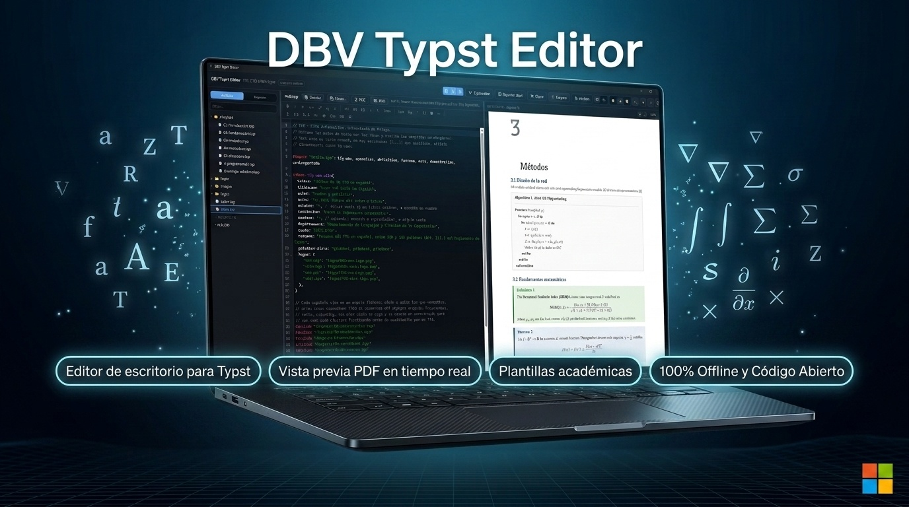

# DBV Typst Editor

**🇪🇸 Español · [🇬🇧 English](./README.en.md)**

[](https://davidbuenov.github.io/dbv-typst-editor/)
[](https://github.com/davidbuenov/dbv-typst-editor/releases)
[](https://apps.microsoft.com/store/detail/9PCPSVTNJMP0?cid=DevShareMCLPCB)


-0078D6?logo=windows&logoColor=white)
-000000?logo=apple&logoColor=white)


[](https://github.com/davidbuenov/dbv-specs-ops)

> Editor de escritorio multiplataforma, ligero y offline-first para documentos [Typst](https://typst.app), con vista previa PDF en tiempo real. *"Academic and technical writing made simple. Powered by Typst."*
>
> 🌐 **Sitio web oficial:** [https://davidbuenov.github.io/dbv-typst-editor/](https://davidbuenov.github.io/dbv-typst-editor/)

<p align="center">
  <a href="https://davidbuenov.github.io/dbv-typst-editor/">
    
  </a>
</p>

---

## 📑 Índice

- [Sobre el proyecto](#-sobre-el-proyecto)
- [Estado actual](#-estado-actual)
- [Descárgalo e instálalo](#-descárgalo-e-instálalo)
- [Público objetivo](#-público-objetivo)
- [Funcionalidades del MVP](#-funcionalidades-del-mvp)
- [Requisitos](#-requisitos)
- [Instalación (desarrollo)](#-instalación-desarrollo)
- [Cómo ejecutar](#-cómo-ejecutar)
- [Cómo parar](#-cómo-parar)
- [Estructura del proyecto](#-estructura-del-proyecto)
- [Probar la aplicación](#-probar-la-aplicación)
- [Empaquetado y publicación](#-empaquetado-y-publicación)
- [Changelog](#-changelog)
- [Referencias](#-referencias)
- [Licencia](#-licencia)
- [Agradecimientos](#-agradecimientos)
- [Autor y Créditos](#-autor-y-créditos)

---

## 📌 Sobre el proyecto

**DBV Typst Editor** es un editor nativo de escritorio para documentos [Typst](https://typst.app), pensado para profesores, investigadores, doctorandos, estudiantes universitarios y escritores técnicos que necesitan generar PDFs académicos y técnicos de calidad profesional sin depender de LaTeX ni de herramientas online.

Sigue la misma filosofía que su proyecto hermano [DBV Markdown Reader](https://github.com/davidbuenov/dbv-md-reader): ligero, rápido, multiplataforma, offline-first, con una interfaz limpia y una experiencia de escritura agradable. Reutiliza en la medida de lo posible la arquitectura, componentes y decisiones de diseño ya validadas en ese proyecto.

**Built with:** Rust, Tauri v2, Typst CLI/crate, HTML5, Tailwind CSS, JavaScript.

---

## 🚦 Estado actual

**Versión actual:** `v0.10.0` · **Estado:** 🟢 Estable y listo para producción

- 🌐 **Sitio Web Oficial:** [https://davidbuenov.github.io/dbv-typst-editor/](https://davidbuenov.github.io/dbv-typst-editor/) (con galería interactiva de capturas en alta resolución y selector bilingüe ES/EN).
- 📦 **Instaladores disponibles en Releases:** [GitHub Releases](https://github.com/davidbuenov/dbv-typst-editor/releases):
  - 🪟 **Windows**: solo a través de la [Microsoft Store](https://apps.microsoft.com/store/detail/9PCPSVTNJMP0?cid=DevShareMCLPCB) (no hay instalador `.exe` en Releases desde `v0.8.0`).
  - 🍎 **macOS**: Archivo `.dmg` universal (compatible con Apple Silicon e Intel).
  - 🐧 **Linux**: Paquetes `.AppImage` (portable) y `.deb` (Debian/Ubuntu/Mint).
- 🏬 **Microsoft Store:** disponible en la tienda oficial. [🛒 Consíguelo en Microsoft Store (ID 9PCPSVTNJMP0)](https://apps.microsoft.com/store/detail/9PCPSVTNJMP0?cid=DevShareMCLPCB). Si instalaste una versión previa desde la Store, asegúrate de contar con `v0.3.1` o superior (ver [`CHANGELOG.md`](./dbv-specs-ops/CHANGELOG.md)).
- 🧪 **Calidad y estabilidad:** 1.143 pruebas automatizadas pasando al 100% (789 tests de frontend + 354 tests de backend en Rust) y validación de layout en motor Chromium/WebKit real.
- 🚀 **Funcionalidades destacadas incluidas:**
  - **Guardado automático opcional, punto de modificado y cierre de ventana siempre protegido (v0.10.0):** se guarda solo tras una pausa de escritura o al perder el foco, sin sobrescribir nunca un cambio externo; el texto "sin guardar" pasa a ser un punto discreto junto al nombre del documento. Además: resaltado de sintaxis para `.bib`, ficheros ocultos fuera del árbol por defecto, números de línea optativos, botón de refresco siempre visible y ruta corta y desambiguada en la barra del documento — siete mejoras nacidas de que un amigo del usuario probó la v0.9.0 y mandó su lista de "cosas a arreglar".
  - **Motor de vista previa rápido (v0.9.0):** Typst como librería dentro de la aplicación — cada edición de un libro de 224 páginas tarda ≈0,5 s en vez de ≈4,6 s — con sincronización exacta palabra a palabra en los dos sentidos (doble clic o botón derecho en el render; Ctrl+Alt+P desde el editor), diagnósticos subrayados en el editor, menús contextuales y edición de ficheros de código (`.cpp`, `.java`, `.py` y ~40 tipos más). El motor clásico es el respaldo automático.
  - Rendimiento con documentos grandes: la vista previa suelta las páginas que quedan lejos (un libro de 220 páginas ya no crece hasta ocupar varios GB), la pausa de escritura se adapta a lo que tarda en compilar, y un `.typ` suelto en una carpeta enorme (Descargas, Escritorio) abre en segundos en vez de casi un minuto.
  - Documento principal elegible: etiqueta **principal** en el árbol de ficheros y menú contextual (botón derecho) o menú Archivo para marcar cuál compila la vista previa — imprescindible en proyectos sin `main.typ`. Se recuerda por proyecto y no escribe nada en tu carpeta.
  - Tinymist bajo demanda y desactivable desde su insignia: arranca solo con documentos pequeños y espera a que lo actives con los grandes.
  - Instalación por Homebrew en macOS y Linux (`brew tap davidbuenov/dbv-typst-editor && brew install --cask dbv-typst-editor`), con el comando de consola `typs` para abrir un documento o una carpeta.
  - Editor visual e interactivo de ecuaciones matemáticas, con vista previa REAL compilada por Typst en cada pausa, y "Pegar LaTeX" vía el paquete MiTeX.
  - Cinco asistentes de diagramación más: flujogramas con decisiones, diagramas de secuencia (Chronos), diagramas de Gantt con fechas reales (Gantty), tableros Kanban (Kantan) y render de grafos DOT/Graphviz (Diagraph) — cada uno accesible desde el menú Herramientas, con botón de ayuda contextual y enlace a la documentación original del paquete.
  - Editor WYSIWYG de diagramas: nodos, flechas con dirección/trazo/etiqueta, colores, zoom y arrastrar y soltar — traduce a código `cetz.canvas` legible y se puede reabrir para seguir editando.
  - Zoom contextual con teclado y rueda del ratón: ajusta el tamaño de fuente del editor o el zoom de la vista previa según dónde esté el foco.
  - Integración con Git: estado, commit, push, pull y clonar por URL desde la cabecera, con comparador de diferencias y resolución visual de conflictos de fusión.
  - Universe Browser completo: buscador sobre el catálogo real de Typst Universe (~4.700 paquetes y plantillas), no solo una lista curada, con distinción automática entre paquete y plantilla.
  - Sincronización bidireccional editor ↔ vista previa (doble clic en render para saltar al código fuente y botón chincheta para llevar la vista previa al cursor).
  - Compilación del documento completo (`main.typ`) con conservación de referencias cruzadas y capítulos, más control de refresco automático o manual.
  - Bibliografía visual con `hayagriva`: autocompletado de citas con título/autor/año y aviso de entradas duplicadas o incompletas.
  - Language Server oficial de Typst (tinymist) integrado: autocompletado semántico, diagnósticos en vivo y formateo con un clic.
  - Runner de Python integrado (Matplotlib, NumPy, pandas) y runner de JavaScript con `jogs` para figuras y datos dinámicos.
  - Pegar una imagen directamente desde el portapapeles, además del arrastre universal de archivos.
  - 8 plantillas académicas oficiales preconfiguradas con fuentes incrustadas.
  - Empaquetado completo en un único archivo de proyecto `.dbvt`.
  - 3 temas visuales (Claro, Oscuro y Sepia cálido) y terminal Typst avanzado integrado.

---

## 🚀 Descárgalo e instálalo

**No necesitas instalar Rust, Node.js, ni ninguna herramienta de programación.** El instalador trae todo lo necesario —incluido el compilador Typst— y asocia los archivos `.typ` contigo.

### 🪟 Windows

**[🛒 Consíguelo en Microsoft Store](https://apps.microsoft.com/store/detail/9PCPSVTNJMP0?cid=DevShareMCLPCB)**

Desde `v0.8.0`, Microsoft Store es el **único** canal de instalación para Windows: el paquete lo firma la propia Store (sin avisos de SmartScreen), se instala con un clic y se actualiza solo en segundo plano. Se eligió porque la Store publica las actualizaciones muy rápido y es la forma más segura de recibirlas: no depende de que cada usuario descargue y ejecute un instalador a mano.

El instalador `.exe` de GitHub Releases queda **descontinuado**. Si ya lo tenías instalado así, instala desde la Store para seguir recibiendo actualizaciones: son dos identidades de aplicación distintas, así que convivirán como dos entradas separadas en "Aplicaciones instaladas" hasta que desinstales la antigua. La instalación por `.exe` no recibirá la `v0.8.0` ni posteriores desde "Buscar actualizaciones".

*(Store ID `9PCPSVTNJMP0`. La versión que ofrece la Store es siempre la última que Microsoft ha certificado; puede ir unos días por detrás de la de GitHub. Ver [`CHANGELOG.md`](./dbv-specs-ops/CHANGELOG.md).)*

### 🍺 Homebrew (macOS y Linux)

```bash
brew tap davidbuenov/dbv-typst-editor
brew install --cask dbv-typst-editor
```

Sirve para **macOS** (Intel y Apple Silicon) y para **Linux x86_64**. En Linux necesita Homebrew 6.0.0 o posterior (la versión que admite AppImage en los casks) y FUSE 2 para ejecutar AppImages (`libfuse2` en Debian/Ubuntu). El tap ([davidbuenov/homebrew-dbv-typst-editor](https://github.com/davidbuenov/homebrew-dbv-typst-editor)) se actualiza solo en cada Release nueva y se actualiza con `brew upgrade --cask dbv-typst-editor`. En macOS no sustituye el aviso de Gatekeeper de más abajo: el `.dmg` sigue sin firma ni notarización de Apple.

**Desde la consola:** el Cask instala también el comando `typs`, para abrir la aplicación sin soltar el teclado:

```bash
typs                 # abre la aplicación
typs informe.typ     # abre un documento
typs tesis/          # abre una carpeta como proyecto
typs .               # abre la carpeta actual
```

Con la aplicación ya abierta, `typs` reutiliza la misma ventana. `brew uninstall --cask dbv-typst-editor` lo retira.

### 🐧 Linux

**[⬇️ Descarga el `.deb` o el `.AppImage` desde Releases](https://github.com/davidbuenov/dbv-typst-editor/releases)** — se generan automáticamente en cada versión vía CI.

- **`.deb` (Debian, Ubuntu, Linux Mint y derivadas):** `sudo dpkg -i "DBV Typst Editor_x.y.z_amd64.deb"` (o doble clic desde el gestor de archivos).
- **`.AppImage` (cualquier distribución):** `chmod +x "DBV Typst Editor_x.y.z_amd64.AppImage"` y ejecútalo directamente. Portátil, sin instalación.

> El canal de Linux no tiene comprobación de actualizaciones integrada — descarga la versión nueva desde Releases cuando quieras actualizar.

### 🍎 macOS

**[⬇️ Descarga el `.dmg` desde Releases](https://github.com/davidbuenov/dbv-typst-editor/releases)** — build universal (Apple Silicon + Intel), generado automáticamente vía CI.

No está firmado ni notarizado (requeriría una cuenta Apple Developer de pago). macOS lo bloqueará la primera vez:

- Clic derecho sobre `DBV Typst Editor.app` → **Abrir** → confirmar en el diálogo.
- O desde la Terminal: `xattr -cr "DBV Typst Editor.app"` antes de abrirlo.

---

## 🎯 Público objetivo

- Profesores y docentes universitarios
- Investigadores y doctorandos
- Estudiantes universitarios (TFG, TFM, tesis)
- Escritores técnicos
- Cualquier persona que quiera generar PDFs profesionales con Typst sin fricción

---

## ✅ Funcionalidades del MVP

- **Lanzador orientado a tareas:** la aplicación no abre un editor vacío, pregunta qué quieres escribir.
- **Asistente de creación de proyecto:** eliges plantilla, rellenas cuatro datos y el proyecto queda listo para compilar.
- **Plantillas curadas:** Proyecto en blanco, Trabajo de Fin de Grado, Artículo académico y Currículum vitae. Cada proyecto generado es Typst estándar y compila con `typst` a secas, sin depender de esta aplicación.
- **Modelo de proyecto, no de fichero suelto:** explorador lateral, proyectos recientes y "mostrar en el explorador del sistema". Abrir un repositorio Git clonado o un proyecto Typst hecho a mano funciona igual de bien, y la aplicación no escribe nada en su carpeta.
- **Editor Typst real:** CodeMirror 6 con resaltado de la sintaxis de Typst 0.15, autocompletado de las funciones y símbolos integrados, plegado, numeración de líneas, búsqueda y reemplazo y selección múltiple.
- **Vista previa en tiempo real:** el PDF se recompila solo tras cada pausa de escritura, con zoom y carga de páginas bajo demanda. Un error de sintaxis a medio escribir no borra la vista: mantiene la última correcta y muestra el error en una banda.
- **Guardar, guardar como y detección de cambios externos**, con recarga automática cuando no hay nada que perder y aviso solo cuando lo hay.
- **Exportación a PDF** del documento tal como se ve, incluidos los cambios sin guardar.
- **Temas claro, oscuro y sepia**, interfaz en español e inglés y compilador Typst embebido: todo funciona sin conexión.
- **Empaquetado** para Windows (NSIS) y Linux (AppImage + `.deb`), con asociación de fichero `.typ`. macOS tiene menú nativo escrito, pendiente de su primera compilación real.
- **Typst Universe:** plantillas y paquetes de la comunidad, lista curada + identificador libre, con detección de fuentes que faltan en los avisos del compilador y la posibilidad de arrastrarlas al proyecto para añadirlas.
- **Project Archive `.dbvt`, barra de herramientas de inserción, outline, terminal avanzado, modos de escritura, gestión de imágenes/citas/bibliografía por asistente, instancia única y actualizador automático** — el detalle completo de cada uno vive en `CHANGELOG.md`.

El detalle completo de requisitos y criterios de aceptación vive en [`dbv-specs-ops/docs/SPECIFICATIONS.md`](./dbv-specs-ops/docs/SPECIFICATIONS.md).

---

## 🧰 Requisitos

- [Rust](https://www.rust-lang.org/) 1.76+ y toolchain de [Tauri v2](https://v2.tauri.app/start/prerequisites/)
- Node.js 20+ (si el frontend usa un bundler)
- [Typst](https://github.com/typst/typst) CLI oficial, vendorizado como sidecar (ver `npm run vendor:typst` más abajo) — no hace falta instalarlo aparte

---

## ⚙️ Instalación (desarrollo)

```bash
# Clona el repositorio
git clone https://github.com/davidbuenov/dbv-typst-editor.git
cd dbv-typst-editor

# Instala dependencias del frontend
npm install

# Descarga el compilador Typst oficial que viaja dentro de la app (sidecar).
# Paso OBLIGATORIO: sin él la aplicación no puede compilar documentos.
npm run vendor:typst

# (opcional) Verifica el sidecar contra el binario real: 8 comprobaciones
npm run verify:typst

# (opcional) Verifica el catálogo de plantillas: instancia cada plantilla con el
# compilador real, sustituye datos de ejemplo y comprueba que compila a PDF
npm run verify:templates

# Tests: lógica del frontend (Vitest, 789) + backend Rust (354)
npm test
```

El binario de Typst **no se versiona en el repositorio**: se descarga de la release oficial fijada en `scripts/vendor-typst.mjs`. El mismo paso se ejecuta en CI antes de empaquetar.

Requisitos adicionales: los [prerrequisitos de Tauri v2](https://v2.tauri.app/start/prerequisites/) de tu sistema operativo.

---

## ▶️ Cómo ejecutar

**Windows:**
```cmd
start.cmd
```

**macOS / Linux:**
```bash
./start.sh
```

---

## ⏹ Cómo parar

**Windows:**
```cmd
stop.cmd
```

**macOS / Linux:**
```bash
./stop.sh
```

---

## 📂 Estructura del proyecto

```
/
├── src/                        # Frontend (ESM, sin monolito)
│   ├── app/                     # Estado del espacio de trabajo
│   ├── editor/                   # Editor CodeMirror 6 + lenguaje Typst
│   ├── preview/                   # Vista previa SVG en tiempo real
│   ├── launcher/                   # Lanzador orientado a tareas
│   ├── project-wizard/              # Asistente de creación de proyecto
│   ├── project-explorer/             # Árbol de ficheros del proyecto
│   ├── services/                      # Única frontera con el backend
│   ├── panels/ · ui/ · themes/ · i18n/ # Paneles, controles, temas y traducciones
├── src-tauri/                  # Backend Rust
│   └── src/                     # commands/, project.rs, templates.rs,
│                                 # typst_engine/, watcher.rs, error.rs
├── templates/local/            # Plantillas curadas, como paquetes `@local`
├── testfiles/                  # Documento y proyecto de prueba para abrir en la app
├── scripts/                    # Vendorizado y verificaciones sin dependencias
├── dbv-specs-ops/              # Documentación SDD (specs, arquitectura, memoria)
├── start.cmd / start.sh        # Scripts de arranque
├── stop.cmd / stop.sh          # Scripts de parada
└── README.md                   # Este fichero
```

---

## 🧪 Probar la aplicación

Si acabas de arrancarla y quieres algo que abrir, hay dos ficheros de prueba en [`testfiles/`](./testfiles/):

| Qué | Cómo abrirlo | Qué comprueba |
| --- | --- | --- |
| `testfiles/demo-suelto.typ` | **Abrir documento .typ** | Un `.typ` suelto como proyecto de un solo fichero: edición, vista previa en vivo, banda de error y exportación |
| `testfiles/demo-proyecto/` | **Abrir carpeta de proyecto** | Proyecto multi-fichero real: explorador, capítulos con `#include`, imagen desde `images/`, bibliografía y referencias cruzadas |

`demo-proyecto` **no trae manifiesto DBV a propósito**: se comporta como un repositorio clonado o un proyecto Typst hecho a mano, así que la cabecera debe etiquetarlo como *proyecto externo* y la aplicación no debe escribir nada en su carpeta (RF-02b).

Cada fichero lleva dentro una lista de lo que conviene probar con él. La otra vía, si prefieres empezar de cero, es el propio lanzador: **Proyecto en blanco** → elegir carpeta → *Crear proyecto*.

---

## 📦 Empaquetado y publicación

```bash
# Instalador de la plataforma actual (Windows: NSIS de ~18 MB)
npm run build

# Solo Windows: variante con el instalador de WebView2 embebido (~268 MB), para
# equipos sin WebView2 y sin conexión — aulas aisladas, por ejemplo
npm run build:win:offline

# Solo Windows: genera el .msix para Microsoft Store (el único canal de Windows
# desde v0.8.0). No necesita ninguna clave de firma propia: la Store re-firma el
# paquete con la suya al recibirlo
npm run tauri:windows:build
```

Pasos del build de Windows para la Store: [`dbv-specs-ops/docs/WINDOWS_RELEASE.md`](./dbv-specs-ops/docs/WINDOWS_RELEASE.md).

| Plataforma | Quién compila | Release |
| --- | --- | --- |
| **Windows** | El mantenedor, en local (`npm run tauri:windows:build`); no requiere clave de firma | Solo Microsoft Store: el `.msixbundle` se sube a Partner Center. Ya no se sube ningún `.exe` a la Release |
| **Linux** | GitHub Actions (`release-linux.yml`) al empujar un tag `vX.Y.Z` | Adjunta AppImage y `.deb` al borrador automáticamente |
| **macOS** | GitHub Actions (`release-macos.yml`), build universal | Adjunta `.dmg` al borrador automáticamente |

El workflow vendoriza el compilador Typst antes de empaquetar y **falla de forma explícita si falta**: un instalador sin compilador dentro no serviría de nada. Cada push ejecuta además el workflow `ci.yml` con los tests, el build del frontend y las dos verificaciones contra el compilador real.

Preparación para Microsoft Store documentada en [`dbv-specs-ops/docs/MICROSOFT_STORE.md`](./dbv-specs-ops/docs/MICROSOFT_STORE.md).

---

## 📋 Changelog

`v0.8.0` documentada en [`dbv-specs-ops/CHANGELOG.md`](./dbv-specs-ops/CHANGELOG.md) — rendimiento con documentos grandes (descarte de páginas de la vista previa, réplica temporal acotada, pausa de escritura adaptativa), documento principal elegible desde el árbol, Tinymist bajo demanda, y canal Homebrew para macOS y Linux con el comando `typs`. La `v0.7.0` añadió: editor visual e interactivo de ecuaciones matemáticas, cinco asistentes de diagramación nuevos (secuencia, Gantt, Kanban, DOT/Graphviz y flujogramas con decisiones), botón de ayuda contextual con enlace a la documentación original en cada asistente, zoom contextual con teclado/rueda, y una batería de correcciones de UX (separador bloqueable, aviso de `ResizeObserver`, rediseño de la pantalla de inicio) encontradas usando la aplicación con un proyecto real.

El changelog se mantiene en los dos idiomas: [Español](./dbv-specs-ops/CHANGELOG.md) · [English](./dbv-specs-ops/CHANGELOG.en.md).

---

## 📚 Referencias

- **Voynov, A., Corbi, A., López-Oliver, P., & Gil, D. (2026).** [*Typst: A Modern Typesetting Engine for Science*](https://doi.org/10.9781/ijimai.2026.2269). *International Journal of Interactive Multimedia and Artificial Intelligence, 9*(7), 107–120. Revisión sistemática del ecosistema Typst (motor, lenguaje, paquetes de Typst Universe, adopción) con estudios de caso en Física, Matemáticas e Informática. La Sección XI ("Application of Typst for Computer Science") cataloga paquetes de diagramación — Fletcher/Matofletcher (diagramas de flujo), CeTZ (árboles, gráficos), Diagraph (DOT/Graphviz vía Wasm), Pintora/Pintorita (diagramas de actividad, clases, ER), Chronos (diagramas de secuencia), Gantty/Timeliney (Gantt) y Kantan (tableros Kanban) — que sirven de mapa de referencia para valorar futuras integraciones en el editor. Uno de sus autores, **Alberto Corbi**, es colaborador de este proyecto (ver la sección de Autor y Créditos más abajo).

---

## 📄 Licencia

MIT — ver [LICENSE](./LICENSE) para más detalles.

Copyright (c) 2026 David Bueno Vallejo

---

## 🙏 Agradecimientos

Esta aplicación no existiría sin el trabajo de un buen número de proyectos de código abierto. Gracias a sus autores y mantenedores:

### Motor y lenguaje

- [Typst](https://typst.app) — el motor de composición tipográfica sobre el que se construye toda la aplicación (binario vendorizado como sidecar de compilación y, desde la v0.9.0, sus crates `typst`, `typst-ide`, `typst-layout`, `typst-svg` y `typst-kit` enlazados en la aplicación para el motor de vista previa en proceso; licencia Apache-2.0).
- [Hilbert Editor](https://github.com/aburousan/hilbert-editor) (MIT) — el estudio de su sincronización clic→fuente con el `Span` de cada glifo inspiró el mapa render↔fuente de la v0.9.0; la implementación es propia.
- [Tinymist](https://github.com/Myriad-Dreamin/tinymist) — Language Server oficial de Typst, vendorizado para autocompletado semántico, diagnósticos en vivo y formateo.

### Paquetes de Typst Universe usados por los asistentes visuales de la aplicación

- [cetz](https://typst.app/universe/package/cetz) — motor de dibujo detrás del editor WYSIWYG de diagramas.
- [MiTeX](https://typst.app/universe/package/mitex) — conversión de LaTeX pegado en el editor visual de ecuaciones.
- [Chronos](https://typst.app/universe/package/chronos) — diagramas de secuencia.
- [Gantty](https://typst.app/universe/package/gantty) — diagramas de Gantt con fechas reales.
- [Kantan](https://typst.app/universe/package/kantan) — tableros Kanban.
- [Diagraph](https://typst.app/universe/package/diagraph) — render de grafos DOT/Graphviz vía un plugin Wasm.
- [jogs](https://typst.app/universe/package/jogs) — runtime JavaScript embebido (QuickJS) para figuras y datos dinámicos.

### Piezas centrales de la aplicación

- [Tauri](https://tauri.app) — el framework de escritorio (Rust + WebView nativo) sobre el que corre toda la aplicación, junto con sus plugins `shell`, `dialog`, `updater`, `process` y `single-instance`.
- [CodeMirror 6](https://codemirror.net) y [codemirror-lang-typst](https://github.com/kxxt/codemirror-lang-typst) — el editor de código y su resaltado de sintaxis Typst.
- [Hayagriva](https://github.com/typst/hayagriva) — el mismo motor de bibliografía BibTeX/Hayagriva que usa el propio compilador Typst para `#bibliography()`.
- [Vite](https://vite.dev) — empaquetado y servidor de desarrollo del frontend.
- Crates de Rust: [serde](https://serde.rs)/serde_json, [tokio](https://tokio.rs), [notify](https://github.com/notify-rs/notify), [toml](https://github.com/toml-rs/toml), [tempfile](https://github.com/Stebalien/tempfile), [zip](https://github.com/zip-rs/zip2), [dunce](https://gitlab.com/kornelski/dunce), [base64](https://github.com/marshallpierce/rust-base64), [ureq](https://github.com/algesten/ureq) y [sys-locale](https://github.com/1Password/sys-locale) (macOS).

Gracias también a los mantenedores de todos los paquetes curados en el Universe Browser de la aplicación (ver [`src/universe/curatedCatalog.js`](./src/universe/curatedCatalog.js)) — plantillas de IEEE/ACM/Springer, `fletcher`, `touying`, `quick-maths`, `physica`, `codly`, `zebraw`, `showybox`, `tablem`, `subpar`, `lovelace`, `glossarium`, `unify`, `wordometer` y el resto — por su trabajo, aunque no todos quepan uno a uno en esta lista.

### Publicación en Microsoft Store

- [tauri-windows-bundle](https://github.com/Choochmeque/tauri-windows-bundle), de **Vladimir Pankratov** — la herramienta que genera el paquete `.msix` con el que esta aplicación está publicada en Microsoft Store; sin ella, la vía oficial de Tauri para la Store exigiría un certificado Authenticode de pago.

---

## ✍️ Autor y Créditos

### 👤 David Bueno Vallejo

> Idea original, arquitectura, dirección del proyecto y desarrollo.

[](https://www.linkedin.com/in/davidbueno/)
[](https://davidbuenov.com)
[](https://github.com/davidbuenov)

### 👥 Colaboradores

- **Juan Falgueras Cano**
- **Alberto Corbi**

### 🤖 Construido con IA

| Herramienta | Rol |
| --- | --- |
| **[Gemini](https://deepmind.google/technologies/gemini/)** · *Google DeepMind* | Desarrollo y pair programming: frontend, sincronización bidireccional editor ↔ vista previa, interfaz/UX, integración de comandos y optimizaciones. |
| **[Claude Code](https://claude.com/claude-code)** · *Anthropic* | Desarrollo y pair programming: arquitectura Rust/Tauri v2, motor de compilación Typst y renderizado SVG/PNG/PDF, testing y ciclo de vida de la aplicación. |
| **[Microsoft Copilot](https://copilot.microsoft.com/)** · *Microsoft* | Planificación inicial, estructuración y definición de requerimientos del proyecto. |

> 🛠️ Desarrollado con el framework **[dbv-specs-ops](https://github.com/davidbuenov/dbv-specs-ops)** — Spec-Driven Development, libre y gratuito.
