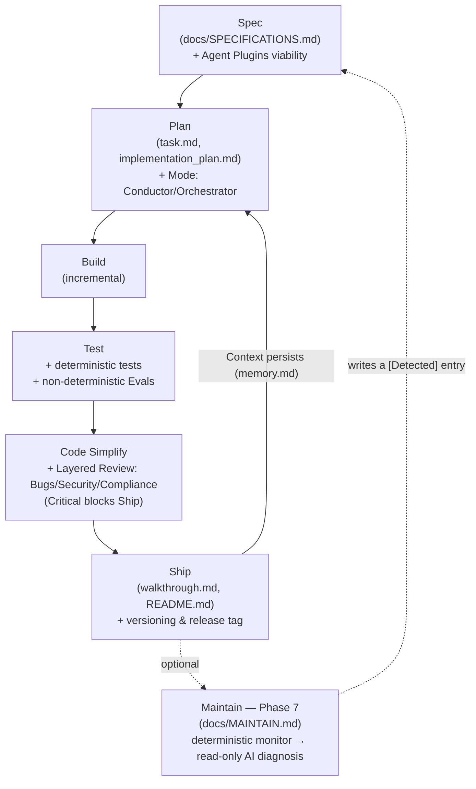

# ⚡ dbv-specs-ops

> *The blueprint that turns any AI assistant into a disciplined Senior Engineer.*

<p align="right">🇬🇧 English · <a href="./README.md">🇪🇸 Leer en español</a></p>


---

## 📑 Table of Contents

- [Key Features](#features)
- [Origin & Inspiration](#origin)
- [Visual Workflow](#workflow)
- [The 6 Development Phases](#phases)
- [File Structure](#structure)
- [Platform Activation](#platforms)
- [Quick Start](#quickstart)
- [Adopting an Existing Project](#adoption)
- [Upgrading an Existing Project](#upgrade)
- [Example Usage](#example)
- [FAQ](#faq)
- [Contributing](#contributing)
- [Status](#status)
- [Authors & Credits](#credits)
- [Inspiration & References](#references)

---

**dbv-specs-ops** is a lightweight engineering system designed to maximize software quality and context persistence in AI-assisted development.

This repository acts as a **master blueprint** that transforms your AI assistant from a simple code generator into a Senior Software Engineer that follows rigorous processes.

---

<a name="features"></a>
## ✨ Key Features

*   **Spec-Driven Development (SDD) Lifecycle**: A strict 6-phase flow (*Spec → Plan → Build → Test → Simplify → Ship*) that ensures your AI assistant understands the "why" and "what" before writing a single line of code.
*   **Context & Token Economics**: Leverages structured persistence files (`memory.md` for qualitative design decisions and `task.md` for task logs) to eliminate AI amnesia and optimize token consumption in large projects.
*   **Dual Coding Modes**: The AI self-classifies tasks as *Conductor Mode* (quick, interactive IDE edits) or *Orchestrator Mode* (autonomous, background tasks using asynchronous commands).
*   **Unified Validation (Tests & Evals)**: Combines classical deterministic testing with non-deterministic AI Evals (LLM Judges, formatting checks, and hallucination scans) in the `/test` phase.
*   **Security Review Gate**: A mandatory `/code-simplify` phase that automatically audits code for credential leaks, dependency squatting (*slopsquatting*), and input sanitization.
*   **Declarative Agent Harness**: Configures how the AI interacts with local sandbox environments and resources via the universal **Agent Plugins 1.0.0** standard.
*   **Native Agent Readiness (Web/APIs)**: If enabled, it automatically bootstraps the standard files, headers, and directories (`robots.txt` with Content-Signals, `llms.txt`, `auth.md`, catalogs under `.well-known/` and a unified **Agent Plugin** directory containing `plugin.json` and `mcp.json` specs) to make your web project perfectly readable and discoverable for external AI agents.
*   **Zero-Collision Upgrades**: A dedicated upgrade prompt agent that automatically migrates your project's framework files without touching your source code or custom specs.
*   **Design Enrichment & Audits (Optional)**: Seamlessly integrates community visual design tools (**[Impeccable](https://github.com/pbakaus/impeccable)** for dual-agent accessibility/contrast audits and Nielsen heuristics, and **[SkillUI](https://github.com/amaancoderx/npxskillui)** for extraction/reverse engineering of design tokens from reference URLs).
*   **Layered Code Review with Severities (`docs/REVIEW.md`)**: `/code-simplify` runs three explicit passes (Bugs, Security, Compliance — including this prompt's own `<coding_standards>`) tagged Critical / Important / Nit — Critical findings block `/ship`.
*   **Deterministic Guardrails (Optional, `docs/GUARDRAILS.md`)**: Distinguishes *advisory* instructions (this prompt) from git/CI-level guardrails (pre-commit hooks, branch protection) that hold even if the model forgets a rule.
*   **Formalized Parallel Work (`docs/PARALLEL_WORK.md`)**: Concrete `git worktree` mechanics for running 2-3 independent AI sessions in parallel, plus a portable pattern for scoped read-only subtasks.
*   **Optional Maintain Phase — Loop Closure (`docs/MAINTAIN.md`)**: A deterministic monitor can trigger a read-only AI diagnosis that writes a new `[Detected]` entry into `SPECIFICATIONS.md`, re-entering the cycle at `/plan` — disabled by default, never deploys or merges on its own.
*   **Native Claude Code Commands (`.claude/commands/`)**: `/spec /plan /build /test /code-simplify /ship /maintain` ship as real slash commands with autocomplete, not just chat text.

---

<a name="origin"></a>
## 📑 Origin & Inspiration

This workflow is a unified, simplified version of industry pillars, adapted to be lightweight and highly effective:

1. **[Agent Skills (Google/Addy Osmani)](https://github.com/addyosmani/agent-skills):** The **process and technical workflow** (Cycle: Spec → Plan → Build → Test → Simplify → Ship).
2. **[GitHub Spec-Kit](https://github.com/github/spec-kit):** The **quality of specification**, focusing on understanding the problem, risks, and open questions before coding.
3. **[AI Coding Best Practices](https://github.com/davidbuenov/ai-coding-best-practices):** The final layer of **style and excellence** that dictates how the final code should be written.
4. **[design.md (Google Labs)](https://github.com/google-labs-code/design.md):** The **visual design system standard** — a format for describing a visual identity to coding agents, now integrated as `docs/DESIGN.md`.
5. **[The New SDLC With Vibe Coding (Google/Addy Osmani et al.)](https://www.kaggle.com/whitepaper-the-new-SDLC-with-vibe-coding):** The theoretical foundation for **Agentic Engineering** (transitioning from prompting to a controlled codebase factory model, Evals, and Harness engineering).
6. **[Agent Plugins](https://agent-plugins.org/specification):** The **vendor-neutral standard** (by Google, Amazon, Microsoft, OpenAI, Vercel) for packaging Agent Skills and MCP servers into a portable unit, integrated under `docs/AGENT_PLUGINS.md`.
7. **[The AI-Native SDLC Playbook (Anthropic)](https://claude.com/blog/the-ai-native-sdlc-playbook):** The blueprint for **closing the loop** — adapted, vendor-agnostically, as the optional Maintain phase (`docs/MAINTAIN.md`), layered code review with severities (`docs/REVIEW.md`), deterministic guardrails (`docs/GUARDRAILS.md`), and formalized parallel worktree sessions (`docs/PARALLEL_WORK.md`).

---

<a name="workflow"></a>
## 🗺️ Visual Workflow



---

<a name="phases"></a>
## ⚩️ The 6 Development Phases

Each phase has a **trigger command** you can type in the chat at any time. The AI will always respect this order — never skipping a phase without your approval. A bare command (just `/build`, with no extra text) is enough: the AI treats it as "run this phase now," cascading through any missing prior phase instead of rejecting it.

| # | Phase | Command | What the AI does | What you do | Output |
|---|---|---|---|---|---|
| 1 | **Spec** | `/spec` | Reviews if the requirement is defined in `SPECIFICATIONS.md`. If not, asks clarifying questions before acting. | Describe the feature or change you need. | Updated `SPECIFICATIONS.md` |
| 2 | **Plan** | `/plan` | **Architect Review:** Validates specs for edge cases first. If valid, breaks the work into atomic steps. For complex tasks, creates `implementation_plan.md` and waits for explicit approval. | Review and approve the plan. | `task.md` + `implementation_plan.md` |
| 3 | **Build** | `/build` | Implements logic incrementally. Adds file headers, sets up `venv` for Python, generates startup scripts, updates `CHANGELOG.md [Unreleased]`. | Sit back. Review the code if you wish. | Source code + `CHANGELOG.md` updated |
| 4 | **Test** | `/test` | Creates and runs unit or integration tests. A task is **not marked as done** without a passing test. Fixes found bugs and logs them in `CHANGELOG.md`. | Run the tests if you want to confirm locally. | Test files + `CHANGELOG.md` updated |
| 5 | **Simplify** | `/code-simplify` | Runs the layered review (`docs/REVIEW.md`: Bugs / Security / Compliance) then refactors for clarity. No new features — only polish and Critical fixes. "Clarity over cleverness." | Optional: review and validate the refactor. | Cleaner, simpler code |
| 6 | **Ship** | `/ship` | Blocks if Critical review findings remain. Updates `README.md`, completes `walkthrough.md`, asks for version type (Patch / Minor / Major), publishes `CHANGELOG.md`, proposes git commit + tag. | Choose the version type and confirm. | Versioned release 🚀 |

> **Tip:** You can jump to any phase by command. For example, type `/ship` when you're ready to deliver and the AI will handle versioning, changelog and git automatically.

> **Optional Phase 7 — Maintain (`/maintain`):** Closes the loop without a human trigger. A deterministic
> monitor (CI/cron watching a metric) can invoke the AI read-only to diagnose a deviation and write it as a
> new `[Detected]` entry in `SPECIFICATIONS.md`, which then re-enters the cycle at `/plan` like any other
> requirement. Disabled by default — enable it in `project.config.md`. See [`docs/MAINTAIN.md`](./dbv-specs-ops/docs/MAINTAIN.md).

---

<a name="structure"></a>
## 📂 File Structure

All control files of the framework reside inside the `dbv-specs-ops/` folder:

#### `/dbv-specs-ops/docs` folder:
| File | Purpose |
|---|---|
| [`MASTER_PROMPT.md`](./dbv-specs-ops/docs/MASTER_PROMPT.md) | The brain of the system. Rules, workflow and constraints the AI must follow. |
| [`SPECIFICATIONS.md`](./dbv-specs-ops/docs/SPECIFICATIONS.md) | The "What" and "Why". Problem, objectives and acceptance criteria. |
| [`ARCHITECTURE.md`](./dbv-specs-ops/docs/ARCHITECTURE.md) | The "How". Tech stack, design decisions and system structure. |
| [`DESIGN.md`](./dbv-specs-ops/docs/DESIGN.md) | The "Look". Visual design system: color tokens, typography, spacing and UI components. *(Optional for projects without UI)* |
| [`DESIGN_ENRICHMENT.md`](./dbv-specs-ops/docs/DESIGN_ENRICHMENT.md) | Optional guide for visual audits and reverse-engineering design tokens (Impeccable & SkillUI). |
| [`WEB_TO_DESKTOP_MIGRATION.md`](./dbv-specs-ops/docs/WEB_TO_DESKTOP_MIGRATION.md) | Strategic decisions for turning an existing web app into a native desktop app. Read **before** `NATIVE_DESKTOP_APPS.md`. *(Only when the code already exists as a web app)* |
| [`NATIVE_DESKTOP_APPS.md`](./dbv-specs-ops/docs/NATIVE_DESKTOP_APPS.md) | Desktop app architecture (Tauri v2) & 8 design lessons. *(Optional for web projects)* |
| [`NATIVE_APPS_RELEASE_CI.md`](./dbv-specs-ops/docs/NATIVE_APPS_RELEASE_CI.md) | Cross-platform GitHub Actions CI/CD for native desktop binaries. *(Optional for web projects)* |
| [`MARKETPLACE_PUBLISHING.md`](./dbv-specs-ops/docs/MARKETPLACE_PUBLISHING.md) | App marketplace submission guide & checklist (Microsoft Store, Uptodown, etc.). *(Optional for web projects)* |
| [`REVIEW.md`](./dbv-specs-ops/docs/REVIEW.md) | Review passes and severities (Bugs / Security / Compliance, including `<coding_standards>`) used by `/code-simplify`. |
| [`GUARDRAILS.md`](./dbv-specs-ops/docs/GUARDRAILS.md) | Deterministic guardrails (git/CI) that back up advisory prompt rules. *(Optional)* |
| [`PARALLEL_WORK.md`](./dbv-specs-ops/docs/PARALLEL_WORK.md) | `git worktree` mechanics for running independent AI sessions in parallel (Orchestrator Mode). |
| [`SOURCE_OF_TRUTH.md`](./dbv-specs-ops/docs/SOURCE_OF_TRUTH.md) | How to coexist with an external system (Jira, ServiceNow, etc.). *(Optional)* |
| [`METRICS.md`](./dbv-specs-ops/docs/METRICS.md) | Leading/lagging indicators per phase, readable from git history alone. *(Optional)* |
| [`MAINTAIN.md`](./dbv-specs-ops/docs/MAINTAIN.md) | Optional Phase 7 — autonomous loop closure. See callout above. |

#### `/dbv-specs-ops/` (Framework Root):
| File | Purpose |
|---|---|
| [`project.config.md`](./dbv-specs-ops/project.config.md) | Project identity: name, author, license and file header template. Filled by the AI during the bootstrap interview. |
| [`CHANGELOG.md`](./dbv-specs-ops/CHANGELOG.md) | Version history. The AI updates the `[Unreleased]` section during `/build` and `/test`, and publishes it on each `/ship`. |
| [`task.md`](./dbv-specs-ops/task.md) | The logbook. Quantitative progress (checklist), backlog, and **Context Snapshots**. |
| [`evals/`](./dbv-specs-ops/evals/) + [`scripts/run-evals.sh`](./dbv-specs-ops/scripts/run-evals.sh) | *(Optional)* Regression suite for the agent's own configuration (`MASTER_PROMPT.md` and activation files) — not for your project's code. See `evals/README.md`. |
| [`memory.md`](./dbv-specs-ops/memory.md) | **Context and Decisions.** Qualitative knowledge: active context, technical decisions (ADRs), lessons learned, and relations map. AI must consult it at session start. |
| [`implementation_plan.md`](./dbv-specs-ops/implementation_plan.md) | Created at the `/plan` phase. Detailed technical plan for the AI to fill in and get approved before building. |
| [`walkthrough.md`](./dbv-specs-ops/walkthrough.md) | Created at the `/ship` phase. Summary of what was built, tested and delivered. |

#### Framework root (this repo):
| File | Purpose |
|---|---|
| [`.claude/commands/`](./.claude/commands/) | *(Optional, Claude Code only)* Native slash commands for each phase (`/spec` … `/maintain`) with autocomplete. |

---

<a name="platforms"></a>
## 🤖 Platform Activation

Each AI assistant loads context differently. Use the corresponding file:

| Platform | Activation file | Loading |
|---|---|---|
| **Claude Code** (CLI / VS Code / Desktop) | `CLAUDE.md` | Automatic at session start |
| **GitHub Copilot** (VS Code / JetBrains) | `.github/copilot-instructions.md` | Automatic in the workspace |
| **Cursor** | `CLAUDE.md` (compatible) | Automatic |
| **Antigravity** (VS Code · by Google DeepMind) | `GEMINI.md` (auto) + `ANTIGRAVITY.md` (docs & extra setup) | Automatic (+ optional manual KI setup) |
| **Windsurf** | `.windsurfrules` | Automatic |
| **ChatGPT / Gemini Web** | `docs/MASTER_PROMPT.md` | Manual: attach or paste in the first message |
| **Gemini CLI** | `GEMINI.md` | Automatic |

---

<a name="quickstart"></a>
## 🚀 Quick Start & Integration (Subfolder Isolation)

This framework is designed to live in a dedicated subdirectory (`dbv-specs-ops/`) inside your project's workspace. This keeps your root folder clean, avoids overwriting project files, and keeps SDD metadata isolated.

#### Step 1 — Copy the Framework Folder
Create a folder named `dbv-specs-ops` in the root of your project, and copy all the files from this repository into it.

#### Step 2 — Place the Activation Files in the Root
Since AI assistants only load configuration files from the workspace root directory, you **must copy or create** the appropriate activation file(s) in the root of your project to redirect the AI:

*   **For Claude Code / Cursor (`CLAUDE.md` in root):**
    ```markdown
    Please read and follow the master instructions in dbv-specs-ops/docs/MASTER_PROMPT.md. All specs, tasks, and memory logs are located inside the dbv-specs-ops/ folder.
    ```
    Claude Code users: also copy the [`.claude/commands/`](./.claude/commands/) folder from this repo into
    your project root to get `/spec`, `/plan`, `/build`, `/test`, `/code-simplify`, `/ship` and `/maintain`
    as real native slash commands (with autocomplete) instead of plain chat text.
*   **For GitHub Copilot (`.github/copilot-instructions.md` in root):**
    ```markdown
    This project uses Spec-Driven Development (SDD). Rules, specifications and tasks live in the `dbv-specs-ops/` subdirectory.
    Read and strictly follow `dbv-specs-ops/docs/MASTER_PROMPT.md`.
    ```
*   **For Windsurf (`.windsurfrules` in root):**
    ```json
    {
      "rules": [
        "Please read and follow the master instructions in dbv-specs-ops/docs/MASTER_PROMPT.md. All specs, tasks, and memory logs are located inside the dbv-specs-ops/ folder."
      ]
    }
    ```
*   **For Gemini CLI / Antigravity (`GEMINI.md` in root):**
    ```markdown
    Please follow the SDD rules and files located in `dbv-specs-ops/`.
    Master prompt is at `dbv-specs-ops/docs/MASTER_PROMPT.md`.
    ```

#### Step 3 — Open your AI assistant and kick off the session
Depending on your project state, write the following to your AI assistant:

*   **For New Projects (Quick Start):**
    Simply write `/spec` (or paste `dbv-specs-ops/docs/MASTER_PROMPT.md` if using a manual interface like ChatGPT web). The AI will start the Engineering Interview to define the application requirements, filling out `dbv-specs-ops/docs/SPECIFICATIONS.md`.
*   <a name="adoption"></a>**For Existing Projects (Adoption):**
    Type the following message:
    > "Adapt this project to the SDD methodology using the framework configuration inside the `dbv-specs-ops` folder. Refer to `dbv-specs-ops/docs/ADOPTION_PROMPT.md` for instructions."
    The AI will analyze your existing files and run the interview to populate the SDD files under `dbv-specs-ops/`.

---

<a name="upgrade"></a>
## ⬆️ Upgrading an Existing Project

Already using dbv-specs-ops and want to get the latest features? You only need **one file**.

#### Step 1 — Download `UPGRADE_PROMPT.md`

> **[⬇️ Download UPGRADE_PROMPT.md](https://raw.githubusercontent.com/davidbuenov/dbv-specs-ops/master/docs/UPGRADE_PROMPT.md)**
>
> Right-click → Save As → save it as `docs/UPGRADE_PROMPT.md` inside your project.

#### Step 2 — Tell your AI

```
Read docs/UPGRADE_PROMPT.md and upgrade my project.
```

That's it. The AI detects your current version, calculates what needs updating, and applies only the framework files.

#### What the AI will do
- ✅ Detect your current framework version (reads `project.config.md` or asks you)
- ✅ Download and update only the framework files that changed since your version
- ✅ Add new optional files if missing (e.g. `docs/DESIGN.md` for UI projects)
- ✅ Show you a full summary of every change applied

#### What the AI will NEVER touch

| File | Why it's protected |
|---|---|
| `docs/SPECIFICATIONS.md` | Your project requirements |
| `docs/ARCHITECTURE.md` | Your technical decisions |
| `task.md` | Your backlog and project state |
| `CHANGELOG.md` | Your version history |
| `README.md` | Your project documentation |
| All source code | Your application |

---

<a name="example"></a>
## 🧑‍💻 Example Usage

**1. Phase 1: Specification**

`docs/SPECIFICATIONS.md`:
```markdown
- Problem: "Users forget important tasks."
- Objective: "Build a cross-platform reminder system."
- Feature A: "The user can create, edit and delete reminders."
```

**2. Plan:**

`task.md`:
```markdown
- [ ] Implement the Reminder model
- [ ] Build the REST API for reminders
- [ ] Add unit tests for Reminder
```

**3. Build / Test / Ship:**

The cycle continues until the result is delivered and documented in `walkthrough.md`.

---

<a name="faq"></a>
## ❓ FAQ

**Can I use this template with any AI assistant?**
Yes, it includes activation files for Claude, Copilot, Gemini, Antigravity, Windsurf and ChatGPT.

**What if I already have code?**
Follow the "Adopting an Existing Project" section and use `docs/ADOPTION_PROMPT.md`.

**What if the AI doesn't follow the cycle?**
Make sure it has read `docs/MASTER_PROMPT.md` and that the context is up to date in `task.md`.

**Why does Test come before Simplify?**
Tests are the safety net a refactor is checked against. Passing tests first means any failure after `/code-simplify` unambiguously came from the refactor, not from a pre-existing bug — "make it work, then make it right."

**How do I contribute?**
Fork, create a descriptive branch, and open a Pull Request. See the Contributing section below.

---

<a name="contributing"></a>
## 🤝 Contributing

1. Fork the repository and create a descriptive branch.
2. Make your changes following the cycle: Spec → Plan → Build → Test → Simplify → Ship.
3. Open a Pull Request explaining the reason and the impact.
4. If it's a methodology improvement, add examples and update the documentation.

---

<a name="status"></a>
## 🛠 Status

* **Version:** 2.8.0
* **Methodology:** Spec-Driven Development (SDD)
* **Goal:** Universal AI-assisted development template for any platform and assistant.

---

<a name="credits"></a>
## ✍️ Authors & Credits

### 👤 Conceived and directed by

#### David Bueno Vallejo

> "Original idea, methodology vision, document system design, testing and refinement."

[](https://www.linkedin.com/in/davidbueno/)
[](https://davidbuenov.com)

---

### 📖 Key Reference Book
* **[The New SDLC With Vibe Coding](https://www.kaggle.com/whitepaper-the-new-SDLC-with-vibe-coding)** — Whitepaper by Addy Osmani, Shubham Saboo and Sokratis Kartakis (Google, May 2026), used as the theoretical foundation for the Agentic Harness, Evals, and the Factory model in v2.0.0.

---

### 🤖 Built with AI Pair Programming

| Tool | Role |
|---|---|
| **[Claude Code](https://claude.ai/code)** · *Anthropic* | Main agent: document structure design, prompt engineering, platform files, methodology refinement. |
| **[Antigravity](https://antigravity.google)** · *Google DeepMind* | Antigravity-specific integration, planning artifacts design, compatibility testing. |
| **[Gemini](https://gemini.google.com)** · *Google* | Methodology validation and adoption flow testing on existing projects. |
| **[ChatGPT](https://chatgpt.com)** · *OpenAI* | Manual flow review and `MASTER_PROMPT.md` compatibility with non-auto-loading models. |

> "The vision was human. The methodology was a conversation."

---

<a name="references"></a>
## 📚 Inspiration & References

* **[Agent Skills](https://github.com/addyosmani/agent-skills)** — Addy Osmani (Google)
* **[The New SDLC With Vibe Coding](https://www.kaggle.com/whitepaper-the-new-SDLC-with-vibe-coding)** — Addy Osmani, Shubham Saboo & Sokratis Kartakis (Google Whitepaper, May 2026)
* **[GitHub Spec-Kit](https://github.com/github/spec-kit)** — GitHub
* **[AI Coding Best Practices](https://github.com/davidbuenov/ai-coding-best-practices)** — David Bueno Vallejo
* **[design.md](https://github.com/google-labs-code/design.md)** — Google Labs
* **[Impeccable](https://github.com/pbakaus/impeccable)** — Paul Bakaus (Visual Audits and Critique CLI)
* **[SkillUI](https://github.com/amaancoderx/npxskillui)** — Amaan Coder (Design System Reverse Engineering CLI)
* **[Agent Plugins Specification](https://agent-plugins.org/specification)** — TSC of Core Maintainers (Google, Amazon, Microsoft, OpenAI, Vercel)
* **[The AI-Native SDLC Playbook](https://claude.com/blog/the-ai-native-sdlc-playbook)** — Anthropic (loop closure, layered review, deterministic guardrails, parallel worktree sessions)
