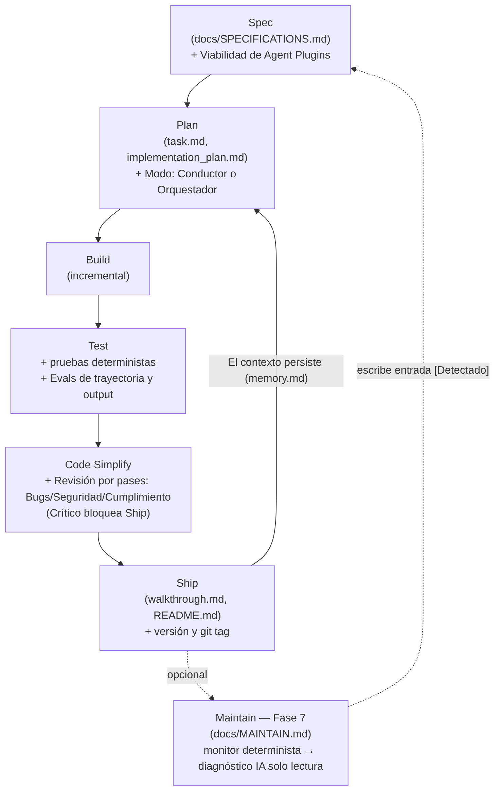

# ⚡ dbv-specs-ops

> *La plantilla que convierte cualquier asistente IA en un Ingeniero Senior disciplinado.*

<p align="right">🇪🇸 Español · <a href="./README.en.md">🇬🇧 Read in English</a></p>


---

## 📑 Índice

- [Características Principales](#features)
- [Origen e Inspiración](#origin)
- [Flujo de Trabajo Visual](#workflow)
- [Las 6 Fases de Desarrollo](#phases)
- [Estructura de Archivos](#structure)
- [Activación por Plataforma](#platforms)
- [Cómo usar (Quick Start)](#quickstart)
- [Incorporar a un Proyecto Existente](#adoption)
- [Actualizar el Framework](#upgrade)
- [Ejemplo de Uso](#example)
- [FAQ / Preguntas Frecuentes](#faq)
- [Contribuir](#contributing)
- [Estado](#status)
- [Autores y Créditos](#credits)
- [Inspiración y Referencias](#references)

---

**dbv-specs-ops** es un motor de ingeniería simplificado diseñado para maximizar la calidad del software y la persistencia del contexto en el desarrollo asistido por Inteligencia Artificial.

Este repositorio actúa como un "Blueprint" o plano maestro que transforma a la IA de un simple generador de código en un Ingeniero de Software Senior que sigue procesos rigurosos.

---

<a name="features"></a>
## ✨ Características Principales

*   **Ciclo Spec-Driven Development (SDD)**: Un flujo riguroso de 6 fases (*Spec → Plan → Build → Test → Simplify → Ship*) que asegura que tu asistente de IA entienda el "por qué" y el "qué" antes de escribir una sola línea de código.
*   **Optimización de Contexto y Token Economics**: Utiliza archivos de persistencia estructurados (`memory.md` para decisiones cualitativas de diseño y `task.md` para registro de tareas) para eliminar la amnesia de la IA y optimizar el consumo de tokens en proyectos grandes.
*   **Modos de Trabajo Inteligentes**: La IA clasifica automáticamente las tareas en *Modo Conductor* (ediciones rápidas e interactivas en el IDE) o *Modo Orquestador* (tareas autónomas de fondo mediante comandos asíncronos).
*   **Validación Unificada (Tests & Evals)**: Combina pruebas deterministas clásicas con Evals probabilísticos de IA (jueces LLM, verificación de formatos y detección de alucinaciones) en la fase `/test`.
*   **Puerta de Auditoría de Seguridad**: Una fase `/code-simplify` obligatoria que audita el código generado buscando fugas de credenciales, dependencias alucinadas o falsas (*slopsquatting*) y validación de entradas.
*   **Arnés del Agente Declarativo**: Configura cómo interactúa el agente con entornos virtuales aislados y recursos mediante el estándar universal **Agent Plugins 1.0.0**.
*   **Agent Readiness por Defecto (Web/APIs)**: Prepara automáticamente los ficheros, cabeceras e infraestructura de autodescubrimiento (`robots.txt` con Content-Signals, `llms.txt`, `auth.md`, catálogos en `.well-known/` y una carpeta de **Agent Plugin** conteniendo `plugin.json` y `mcp.json` estándar) para que los agentes de IA externos naveguen y consuman tu sitio web eficientemente.
*   **Actualizaciones Sin Colisiones**: Un agente de actualización dedicado (`docs/UPGRADE_PROMPT.md`) que migra los ficheros del framework sin tocar tu código fuente ni tus especificaciones personalizadas.
*   **Enriquecimiento y Auditoría de Diseño (Opcional)**: Integra herramientas visuales comunitarias (**[Impeccable](https://github.com/pbakaus/impeccable)** para auditorías de contraste/accesibilidad y heurísticas Nielsen, y **[SkillUI](https://github.com/amaancoderx/npxskillui)** para extracción e ingeniería inversa de tokens a partir de URLs de referencia).
*   **Revisión de Código por Pases con Severidad (`docs/REVIEW.md`)**: `/code-simplify` ejecuta ahora tres pases explícitos (Bugs, Seguridad, Cumplimiento — incluyendo los propios `<coding_standards>` del prompt) etiquetados Crítico / Importante / Nit — lo Crítico bloquea `/ship`.
*   **Guardarraíles Deterministas (Opcional, `docs/GUARDRAILS.md`)**: Distingue instrucciones *advisory* (este prompt) de guardarraíles a nivel de git/CI (pre-commit, branch protection) que se mantienen aunque el modelo olvide una regla.
*   **Trabajo Paralelo Formalizado (`docs/PARALLEL_WORK.md`)**: Mecánica concreta con `git worktree` para ejecutar 2-3 sesiones de IA independientes en paralelo, más un patrón portable de subtareas acotadas de solo lectura.
*   **Fase Maintain Opcional — Cierre del Loop (`docs/MAINTAIN.md`)**: Un monitor determinista puede disparar un diagnóstico de IA en modo solo lectura que escribe una nueva entrada `[Detectado]` en `SPECIFICATIONS.md`, reentrando el ciclo por `/plan` — desactivada por defecto, nunca despliega ni hace merge por sí sola.
*   **Comandos Nativos de Claude Code (`.claude/commands/`)**: `/spec /plan /build /test /code-simplify /ship /maintain` como comandos reales con autocompletado, no solo texto suelto en el chat.

---

<a name="origin"></a>
## 📑 Origen e Inspiración

Este flujo de trabajo es una versión unificada y simplificada de varios pilares de la industria:

1. **[Agent Skills (Google/Addy Osmani)](https://github.com/addyosmani/agent-skills):** El **proceso y el flujo de trabajo** técnico (Ciclo: Spec → Plan → Build → Test → Simplify → Ship).
2. **[GitHub Spec-Kit](https://github.com/github/spec-kit):** La **calidad de la especificación**, enfocándonos en entender el problema antes de codificar.
3. **[AI Coding Best Practices](https://github.com/davidbuenov/ai-coding-best-practices):** La capa de **estilo y excelencia** que dicta cómo debe escribirse el código final.
4. **[design.md (Google Labs)](https://github.com/google-labs-code/design.md):** El **estándar de sistema de diseño visual** — un formato para describir identidades visuales a agentes de codificación, ahora integrado como `docs/DESIGN.md`.
5. **[The New SDLC With Vibe Coding (Google/Addy Osmani et al.)](https://www.kaggle.com/whitepaper-the-new-SDLC-with-vibe-coding):** La base teórica para la **Ingeniería Agéntica** (transición desde el prompting casual hacia un modelo controlado de fábrica de código, Evals y diseño del arnés).
6. **[Agent Plugins](https://agent-plugins.org/specification):** El **estándar neutral de la industria** (Google, Amazon, Microsoft, OpenAI, Vercel) para empaquetar Agent Skills y servidores MCP, integrado bajo `docs/AGENT_PLUGINS.md`.
7. **[The AI-Native SDLC Playbook (Anthropic)](https://claude.com/blog/the-ai-native-sdlc-playbook):** El plano para **cerrar el loop** — adaptado de forma agnóstica de proveedor como la Fase Maintain opcional (`docs/MAINTAIN.md`), la revisión de código por pases con severidad (`docs/REVIEW.md`), los guardarraíles deterministas (`docs/GUARDRAILS.md`) y el trabajo paralelo formalizado con worktrees (`docs/PARALLEL_WORK.md`).

---

<a name="workflow"></a>
## 🗺️ Flujo de Trabajo Visual



---

<a name="phases"></a>
## ⚩️ Las 6 Fases de Desarrollo

Cada fase tiene un **comando de activación** que puedes escribir en el chat en cualquier momento. La IA siempre respetará este orden sin saltarse ninguna fase sin tu aprobación. Un comando escueto (solo `/build`, sin más texto) basta: la IA lo interpreta como "ejecuta ya esta fase", cascadeando por las fases previas que falten en vez de rechazarlo.

| # | Fase | Comando | Qué hace la IA | Qué haces tú | Resultado |
|---|---|---|---|---|---|
| 1 | **Spec** | `/spec` | Revisa si el requisito está definido en `SPECIFICATIONS.md`. Si no, pregunta antes de actuar. | Describe la funcionalidad o cambio que necesitas. | `SPECIFICATIONS.md` actualizado |
| 2 | **Plan** | `/plan` | **Architect Review:** Valida primero las specs buscando edge cases. Si son válidas, desglosa el trabajo en pasos atómicos. Para tareas complejas, crea `implementation_plan.md` y espera tu aprobación. | Revisa y aprueba el plan. | `task.md` + `implementation_plan.md` |
| 3 | **Build** | `/build` | Implementa la lógica de forma incremental. Añade cabeceras a los ficheros, crea `venv` para Python, genera scripts de arranque, actualiza `CHANGELOG.md [Sin publicar]`. | Relájate. Revisa el código si lo deseas. | Código fuente + `CHANGELOG.md` actualizado |
| 4 | **Test** | `/test` | Crea y ejecuta tests unitarios o de integración. Una tarea **no está hecha** sin un test que pase. Corrige los bugs encontrados y los registra en `CHANGELOG.md`. | Ejecuta los tests localmente si quieres confirmar. | Ficheros de test + `CHANGELOG.md` actualizado |
| 5 | **Simplify** | `/code-simplify` | Ejecuta la revisión por pases (`docs/REVIEW.md`: Bugs / Seguridad / Cumplimiento) y después refactoriza para mayor claridad. Sin nuevas funcionalidades — solo pulido y correcciones Crítico. "Clarity over cleverness." | Opcional: revisa y valida el refactor. | Código más limpio y simple |
| 6 | **Ship** | `/ship` | No cierra si quedan hallazgos Crítico de la revisión. Actualiza `README.md`, completa `walkthrough.md`, pregunta el tipo de versión (Patch / Minor / Major), publica `CHANGELOG.md`, propone commit git + tag. | Elige el tipo de versión y confirma. | Release versionado 🚀 |

> **Consejo:** Puedes saltar a cualquier fase por comando. Por ejemplo, escribe `/ship` cuando estés listo para entregar y la IA gestionará automáticamente el versionado, el changelog y git.

> **Fase 7 opcional — Maintain (`/maintain`):** Cierra el loop sin disparo humano. Un monitor determinista
> (CI/cron vigilando una métrica) puede invocar a la IA en modo solo lectura para diagnosticar una
> desviación y redactarla como una nueva entrada `[Detectado]` en `SPECIFICATIONS.md`, que reentra el ciclo
> por `/plan` como cualquier otro requisito. Desactivada por defecto — se activa en `project.config.md`. Ver
> [`docs/MAINTAIN.md`](./dbv-specs-ops/docs/MAINTAIN.md).

---

<a name="structure"></a>
## 📂 Estructura de Archivos

Todos los archivos de control del framework residen dentro de la subcarpeta `dbv-specs-ops/` en tu espacio de trabajo:

#### Carpeta `/dbv-specs-ops/docs`:
| Archivo | Propósito |
|---|---|
| [`MASTER_PROMPT.md`](./dbv-specs-ops/docs/MASTER_PROMPT.md) | El cerebro del sistema. Reglas, workflow y restricciones que la IA debe obedecer. |
| [`SPECIFICATIONS.md`](./dbv-specs-ops/docs/SPECIFICATIONS.md) | El "Qué" y el "Por qué". Problema, objetivos y criterios de aceptación. |
| [`ARCHITECTURE.md`](./dbv-specs-ops/docs/ARCHITECTURE.md) | El "Cómo". Stack tecnológico, decisiones de diseño y estructura del sistema. |
| [`DESIGN.md`](./dbv-specs-ops/docs/DESIGN.md) | El "Aspecto". Sistema de diseño visual: tokens de color, tipografía, espaciado y componentes. *(Opcional para proyectos sin UI)* |
| [`DESIGN_ENRICHMENT.md`](./dbv-specs-ops/docs/DESIGN_ENRICHMENT.md) | Guía para auditorías visuales e ingeniería inversa de tokens de diseño (Impeccable y SkillUI). |
| [`WEB_TO_DESKTOP_MIGRATION.md`](./dbv-specs-ops/docs/WEB_TO_DESKTOP_MIGRATION.md) | Decisiones estratégicas para convertir una app web existente en app de escritorio nativa. Se lee **antes** que `NATIVE_DESKTOP_APPS.md`. *(Solo si el código ya existe como app web)* |
| [`NATIVE_DESKTOP_APPS.md`](./dbv-specs-ops/docs/NATIVE_DESKTOP_APPS.md) | Arquitectura de apps de escritorio (Tauri v2) y 8 lecciones. *(Opcional para proyectos web)* |
| [`NATIVE_APPS_RELEASE_CI.md`](./dbv-specs-ops/docs/NATIVE_APPS_RELEASE_CI.md) | CI/CD multiplataforma con GitHub Actions para binarios nativos. *(Opcional para proyectos web)* |
| [`MARKETPLACE_PUBLISHING.md`](./dbv-specs-ops/docs/MARKETPLACE_PUBLISHING.md) | Guía de publicación en tiendas de apps y checklist (Microsoft Store, Uptodown, etc.). *(Opcional para proyectos web)* |
| [`REVIEW.md`](./dbv-specs-ops/docs/REVIEW.md) | Pases de revisión y severidades (Bugs / Seguridad / Cumplimiento, incluye `<coding_standards>`) usados por `/code-simplify`. |
| [`GUARDRAILS.md`](./dbv-specs-ops/docs/GUARDRAILS.md) | Guardarraíles deterministas (git/CI) que respaldan las reglas advisory del prompt. *(Opcional)* |
| [`PARALLEL_WORK.md`](./dbv-specs-ops/docs/PARALLEL_WORK.md) | Mecánica con `git worktree` para ejecutar sesiones de IA independientes en paralelo (Modo Orquestador). |
| [`SOURCE_OF_TRUTH.md`](./dbv-specs-ops/docs/SOURCE_OF_TRUTH.md) | Cómo convivir con un sistema externo (Jira, ServiceNow, etc.). *(Opcional)* |
| [`METRICS.md`](./dbv-specs-ops/docs/METRICS.md) | Indicadores leader/lagging por fase, legibles solo desde el historial de git. *(Opcional)* |
| [`MAINTAIN.md`](./dbv-specs-ops/docs/MAINTAIN.md) | Fase 7 opcional — cierre autónomo del loop. Ver recuadro arriba. |

#### Carpeta raíz `/dbv-specs-ops/`:
| Archivo | Propósito |
|---|---|
| [`project.config.md`](./dbv-specs-ops/project.config.md) | Identidad del proyecto: nombre, autor, licencia y plantilla de cabeceras. Lo rellena la IA durante la entrevista de bootstrap. |
| [`CHANGELOG.md`](./dbv-specs-ops/CHANGELOG.md) | Historial de versiones. La IA actualiza la sección `[Sin publicar]` durante `/build` y `/test`, y la publica en cada `/ship`. |
| [`task.md`](./dbv-specs-ops/task.md) | El diario de a bordo. Progreso cuantitativo (checklist), backlog, y **Snapshots de Contexto**. |
| [`evals/`](./dbv-specs-ops/evals/) + [`scripts/run-evals.sh`](./dbv-specs-ops/scripts/run-evals.sh) | *(Opcional)* Suite de regresión para la propia configuración del agente (`MASTER_PROMPT.md` y ficheros de activación) — no para el código de tu proyecto. Ver `evals/README.md`. |
| [`memory.md`](./dbv-specs-ops/memory.md) | **Contexto y Decisiones.** Base de conocimiento cualitativo: contexto activo, decisiones técnicas (ADR), lecciones aprendidas y mapa de relaciones. La IA debe consultarlo al iniciar la sesión. |
| [`implementation_plan.md`](./dbv-specs-ops/implementation_plan.md) | Se crea en la fase `/plan`. Plan técnico detallado que la IA rellena y el usuario aprueba antes de construir. |
| [`walkthrough.md`](./dbv-specs-ops/walkthrough.md) | Se crea en la fase `/ship`. Resumen de lo construido, probado y entregado. |

#### Raíz del framework (este repo):
| Archivo | Propósito |
|---|---|
| [`.claude/commands/`](./.claude/commands/) | *(Opcional, solo Claude Code)* Comandos nativos de cada fase (`/spec` … `/maintain`) con autocompletado. |

---

<a name="platforms"></a>
## 🤖 Activación por Plataforma

Cada asistente de IA carga el contexto de forma distinta. Usa el fichero correspondiente:

| Plataforma | Archivo de activación | Carga |
|---|---|---|
| **Claude Code** (CLI / VS Code / Desktop) | `CLAUDE.md` | Automática al iniciar sesión |
| **GitHub Copilot** (VS Code / JetBrains) | `.github/copilot-instructions.md` | Automática en el workspace |
| **Cursor** | `CLAUDE.md` (compatible) | Automática |
| **Antigravity** (VS Code · by Google DeepMind) | `GEMINI.md` (auto) + `ANTIGRAVITY.md` (docs y config extra) | Automática (+ setup KI opcional) |
| **Windsurf** | `.windsurfrules` | Automática |
| **ChatGPT / Gemini Web** | `docs/MASTER_PROMPT.md` | Manual: adjunta o pega en el primer mensaje |
| **Gemini CLI** | `GEMINI.md` | Automática |

---

<a name="quickstart"></a>
## 🚀 Integración y Cómo Usar (Aislamiento en Subcarpeta)

Este framework está diseñado para vivir dentro de un subdirectorio dedicado (`dbv-specs-ops/`) en tu espacio de trabajo. Esto mantiene limpia la raíz de tu proyecto, evita sobreescrituras accidentales de tus archivos y aísla los registros de SDD.

#### Paso 1 — Copia la carpeta del Framework
Crea una carpeta llamada `dbv-specs-ops` en la raíz de tu proyecto y copia todos los archivos de este repositorio dentro de ella.

#### Paso 2 — Coloca los archivos de activación en la raíz
Debido a que los asistentes de IA solo leen archivos de configuración desde la raíz del espacio de trabajo (workspace root), **debes copiar o crear** los archivos de activación correspondientes en la raíz de tu proyecto para redirigir al asistente:

*   **Para Claude Code / Cursor (`CLAUDE.md` en la raíz):**
    ```markdown
    Please read and follow the master instructions in dbv-specs-ops/docs/MASTER_PROMPT.md. All specs, tasks, and memory logs are located inside the dbv-specs-ops/ folder.
    ```
    Usuarios de Claude Code: copia también la carpeta [`.claude/commands/`](./.claude/commands/) de este
    repo a la raíz de tu proyecto para tener `/spec`, `/plan`, `/build`, `/test`, `/code-simplify`, `/ship`
    y `/maintain` como comandos nativos reales (con autocompletado) en vez de texto suelto en el chat.
*   **Para GitHub Copilot (`.github/copilot-instructions.md` en la raíz):**
    ```markdown
    Este proyecto usa Spec-Driven Development (SDD). Las reglas, especificaciones y tareas se encuentran en el subdirectorio `dbv-specs-ops/`.
    Lee y sigue estrictamente `dbv-specs-ops/docs/MASTER_PROMPT.md`.
    ```
*   **Para Windsurf (`.windsurfrules` en la raíz):**
    ```json
    {
      "rules": [
        "Please read and follow the master instructions in dbv-specs-ops/docs/MASTER_PROMPT.md. All specs, tasks, and memory logs are located inside the dbv-specs-ops/ folder."
      ]
    }
    ```
*   **Para Gemini CLI / Antigravity (`GEMINI.md` en la raíz):**
    ```markdown
    Please follow the SDD rules and files located in `dbv-specs-ops/`.
    Master prompt is at `dbv-specs-ops/docs/MASTER_PROMPT.md`.
    ```

#### Paso 3 — Abre tu asistente de IA y arranca la sesión
Según el estado de tu proyecto, escribe a tu asistente de IA:

*   **Para Proyectos Nuevos (Quick Start):**
    Escribe `/spec` (o pega el contenido de `dbv-specs-ops/docs/MASTER_PROMPT.md` si usas una interfaz manual como la web de ChatGPT). La IA iniciará la Entrevista de Ingeniería para definir la aplicación, rellenando `dbv-specs-ops/docs/SPECIFICATIONS.md`.
*   <a name="adoption"></a>**Para Incorporar a Proyectos Existentes (Adopción):**
    Escribe el siguiente mensaje:
    > "Sigue las instrucciones de `dbv-specs-ops/docs/ADOPTION_PROMPT.md` para analizar este proyecto e incorporarlo a la metodología SDD utilizando la configuración dentro de la carpeta `dbv-specs-ops`."
    La IA analizará el código existente y rellenará las especificaciones e historial dentro del subdirectorio `dbv-specs-ops/`.

---

<a name="upgrade"></a>
## ⬆️ Actualizar el Framework

¿Ya usas dbv-specs-ops y quieres acceder a las últimas mejoras? Solo necesitas **un fichero**.

#### Paso 1 — Descarga `UPGRADE_PROMPT.md`

> **[⬇️ Descargar UPGRADE_PROMPT.md](https://raw.githubusercontent.com/davidbuenov/dbv-specs-ops/master/docs/UPGRADE_PROMPT.md)**
>
> Clic derecho → Guardar como → guárdalo como `docs/UPGRADE_PROMPT.md` dentro de tu proyecto.

#### Paso 2 — Dile a tu IA

```
Lee docs/UPGRADE_PROMPT.md y actualiza mi proyecto.
```

Listo. La IA detecta tu versión actual, calcula qué hay que actualizar y aplica solo los ficheros de framework.

#### Qué hará la IA
- ✅ Detectar tu versión actual del framework (lee `project.config.md` o te pregunta)
- ✅ Descargar y actualizar solo los ficheros de framework que cambiaron desde tu versión
- ✅ Añadir ficheros nuevos opcionales si faltan (ej: `docs/DESIGN.md` para proyectos con UI)
- ✅ Mostrarte un resumen completo de todo lo que se aplicó

#### Qué NO tocará nunca

| Fichero | Por qué está protegido |
|---|---|
| `docs/SPECIFICATIONS.md` | Tus requisitos del proyecto |
| `docs/ARCHITECTURE.md` | Tus decisiones técnicas |
| `task.md` | Tu backlog y estado del proyecto |
| `CHANGELOG.md` | Tu historial de versiones |
| `README.md` | Tu documentación del proyecto |
| Todo el código fuente | Tu aplicación |

---

<a name="example"></a>
## 🧑‍💻 Ejemplo de Uso

**1. Fase 1: Especificación**

`docs/SPECIFICATIONS.md`:
```markdown
- Problema: "Los usuarios olvidan tareas importantes."
- Objetivo: "Crear un sistema de recordatorios multiplataforma."
- Funcionalidad A: "El usuario puede crear, editar y eliminar recordatorios."
```

**2. Fase 2: Planificación:**

`task.md`:
```markdown
- [ ] Implementar modelo Reminder
- [ ] Crear API REST para recordatorios
- [ ] Añadir tests unitarios para Reminder
```

**3. Fases de Build / Test / Ship:**

El ciclo continúa de forma incremental hasta que la funcionalidad se entrega y documenta en `walkthrough.md`.

---

<a name="faq"></a>
## ❓ FAQ / Preguntas Frecuentes

**¿Puedo usar esta plantilla con cualquier asistente de IA?**
Sí, incluye archivos de activación compatibles con Claude Code, Copilot, Gemini, Antigravity, Windsurf y ChatGPT.

**¿Qué pasa si ya tengo código existente?**
Sigue las instrucciones de la sección "Incorporar a un Proyecto Existente" y utiliza `docs/ADOPTION_PROMPT.md`.

**¿Qué pasa si la IA no sigue el ciclo de fases?**
Asegúrate de que ha leído `docs/MASTER_PROMPT.md` y que tiene el contexto actualizado en `task.md`.

**¿Por qué Test va antes que Simplify?**
Los tests son la red de seguridad contra la que se verifica un refactor. Si pasan primero, cualquier fallo tras `/code-simplify` viene inequívocamente del refactor, no de un bug preexistente — "hazlo funcionar, luego hazlo bien".

**¿Cómo puedo contribuir al framework?**
Realiza un Fork del repositorio, crea una rama descriptiva y abre una Pull Request explicando tu aportación.

---

<a name="contributing"></a>
## 🤝 Contribuir

1. Realiza un Fork del repositorio y crea una rama descriptiva.
2. Realiza tus cambios siguiendo el ciclo: Spec → Plan → Build → Test → Simplify → Ship.
3. Abre una Pull Request detallando los motivos y el impacto.
4. Si es una mejora metodológica, añade ejemplos y actualiza la documentación.

---

<a name="status"></a>
## 🛠 Estado

* **Versión:** 2.8.0
* **Metodología:** Spec-Driven Development (SDD)
* **Objetivo:** Plantilla universal de desarrollo asistido por IA para cualquier plataforma y asistente.

---

<a name="credits"></a>
## ✍️ Autores y Créditos

### 👤 Concebido y dirigido por

#### David Bueno Vallejo

> "Idea original, visión de la metodología, diseño del sistema de documentos, pruebas y refinamiento."

[](https://www.linkedin.com/in/davidbueno/)
[](https://davidbuenov.com)

---

### 📖 Referencia Teórica Principal
* **[The New SDLC With Vibe Coding](https://www.kaggle.com/whitepaper-the-new-SDLC-with-vibe-coding)** — Whitepaper de Addy Osmani, Shubham Saboo y Sokratis Kartakis (Google, Mayo 2026), utilizado como base teórica fundamental para el diseño del Arnés Agéntico, los Evals y el modelo de Fábrica en la versión 2.0.0.

---

### 🤖 Construido con AI Pair Programming

| Herramienta | Rol |
|---|---|
| **[Claude Code](https://claude.ai/code)** · *Anthropic* | Agente principal: diseño de estructura de documentos, prompt engineering, ficheros de plataforma, refinamiento de la metodología. |
| **[Antigravity](https://antigravity.google)** · *Google DeepMind* | Integración específica con Antigravity, diseño de artefactos de planificación, pruebas de compatibilidad. |
| **[Gemini](https://gemini.google.com)** · *Google* | Validación de la metodología y pruebas del flujo de adopción en proyectos existentes. |
| **[ChatGPT](https://chatgpt.com)** · *OpenAI* | Revisión manual del flujo y compatibilidad de `MASTER_PROMPT.md` con modelos sin carga automática. |

> "La visión fue humana. La metodología fue una conversación."

---

<a name="references"></a>
## 📚 Inspiración y Referencias

* **[Agent Skills](https://github.com/addyosmani/agent-skills)** — Addy Osmani (Google)
* **[The New SDLC With Vibe Coding](https://www.kaggle.com/whitepaper-the-new-SDLC-with-vibe-coding)** — Addy Osmani, Shubham Saboo & Sokratis Kartakis (Google Whitepaper, Mayo 2026)
* **[GitHub Spec-Kit](https://github.com/github/spec-kit)** — GitHub
* **[AI Coding Best Practices](https://github.com/davidbuenov/ai-coding-best-practices)** — David Bueno Vallejo
* **[design.md](https://github.com/google-labs-code/design.md)** — Google Labs
* **[Impeccable](https://github.com/pbakaus/impeccable)** — Paul Bakaus (Visual Audits and Critique CLI)
* **[SkillUI](https://github.com/amaancoderx/npxskillui)** — Amaan Coder (Design System Reverse Engineering CLI)
* **[Agent Plugins Specification](https://agent-plugins.org/specification)** — TSC of Core Maintainers (Google, Amazon, Microsoft, OpenAI, Vercel)
* **[The AI-Native SDLC Playbook](https://claude.com/blog/the-ai-native-sdlc-playbook)** — Anthropic (cierre de loop, revisión por capas, guardarraíles deterministas, sesiones paralelas con worktree)
